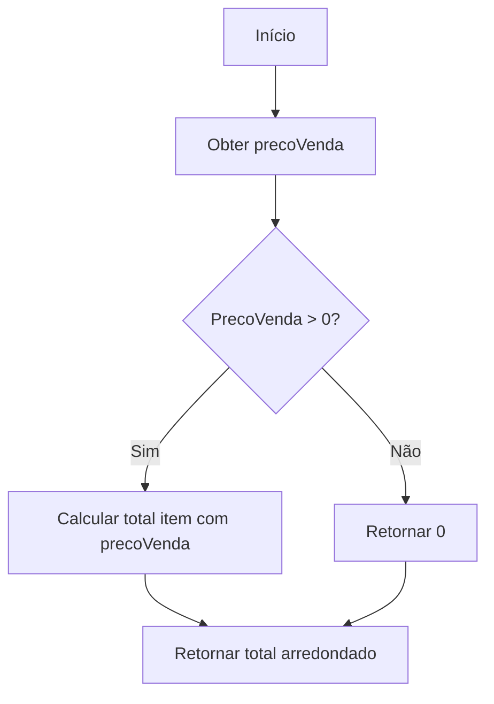
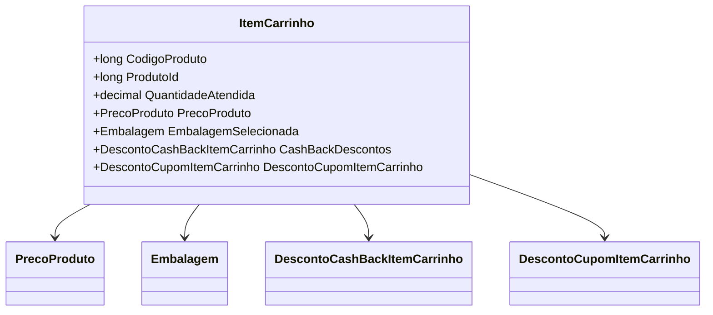

# ItemCarrinho

**Namespace**: IsthmusWinthor.Dominio.POCO.Carrinho  
**Nome do Arquivo**: ItemCarrinho.cs

## Visão Geral e Responsabilidade
A classe `ItemCarrinho` representa um item dentro de um carrinho de compras em um sistema de e-commerce. Sua responsabilidade principal é manter e calcular informações relevantes sobre os produtos adicionados ao carrinho, incluindo preços, quantidades, e descontos, além de oferecer métodos para calcular os totais que um usuário precisa considerar durante a compra.

## Métodos de Negócio

### TotalItemUnidade() (public)
- **Objetivo**: Retornar o preço de venda unitário do produto, considerando as regras de embalagem.
- **Comportamento**:
  1. Obtém o preço de venda do produto da propriedade `PrecoProduto`.
  2. Aplica o método `CalcularTotalItem`, passando o preço de venda obtido.
  3. Retorna o total arredondado, conforme as regras de arredondamento definidas.
- **Retorno**: Preço da unidade do item, arredondado corretamente.

### TotalItem() (public)
- **Objetivo**: Calcular o total do item multiplicado pela quantidade atendida.
- **Comportamento**:
  1. Chama `CalcularTotalItem` com o preço de venda do produto.
  2. Multiplica o total obtido pela quantidade atendida.
  3. Retorna o valor calculado.
- **Retorno**: Total do item com base no preço final e quantidade.

### TotalDesconto() (public)
- **Objetivo**: Calcular o total de desconto aplicado ao item.
- **Comportamento**:
  1. Verifica se há uma promoção disponível.
  2. Se houver, calcula o desconto subtraindo o preço promocional do preço para cliente.
  3. Aplica o `CalcularTotalItem` no valor do desconto.
  4. Multiplica pelo número de itens atendidos e retorna o total.
- **Retorno**: Total de desconto aplicado ao item.

### TotalItemBase() (public)
- **Objetivo**: Retornar o total do item sem impostos.
- **Comportamento**: Similar ao método `TotalItem()`, mas utiliza o preço base em vez do preço do cliente.
- **Retorno**: Total do item sem impostos.

### TotalItemPrecoCliente() (public)
- **Objetivo**: Retornar o total do item considerando o preço do cliente.
- **Comportamento**: Utiliza o método `CalcularTotalItem` com o preço do cliente e multiplica pela quantidade atendida.
- **Retorno**: Total do item baseado no preço do cliente.

### TotalItemPrecoPromocional() (public)
- **Objetivo**: Calcular o total do item considerando o preço promocional.
- **Comportamento**: Segue a mesma lógica dos métodos anteriores, garantindo que o valor retornado reflita o preço promocional.
- **Retorno**: Total do item considerando preço promocional.

### CalcularTotalItem(decimal precoUnidade) (private)
- **Objetivo**: Calcular o preço total de um item, considerando o preço unitário e as embalagens.
- **Comportamento**:
  1. Verifica se o `precoUnidade` é maior que zero.
  2. Se houver embalagem selecionada, calcula o preço com a embalagem.
  3. Aplica o arredondamento necessário e retorna o valor.
- **Retorno**: Valor total arredondado com base no preço unitário.

### PercentualDescontoCashBack (public)
- **Objetivo**: Calcular o percentual de desconto de cashback aplicado.
- **Comportamento**:
  1. Verifica se `PrecoProduto` está válido.
  2. Avalia se o desconto deve ser aplicado com base em `CashBackDescontos`.
  3. Calcula o percentual de desconto baseado no total do item.
- **Retorno**: Percentual de desconto de cashback aplicado.

## Propriedades Calculadas e de Validação
### PercentualDescontoCashBack
- **Regra**: Calcula o percentual de desconto baseado no total do item, considerando se cashback é aplicável.

## Navigations Property
- [PrecoProduto](PrecoProduto.md)
- [Embalagem](Embalagem.md)
- [DescontoCashBackItemCarrinho](DescontoCashBackItemCarrinho.md)
- [DescontoCupomItemCarrinho](DescontoCupomItemCarrinho.md)
- [CashBackCampanhaItemCarrinho](CashBackCampanhaItemCarrinho.md)
- [IsthmusIndustriaItemCarrinho](IsthmusIndustriaItemCarrinho.md)

## Tipos Auxiliares e Dependências
- [TipoPlanoPagamento](TipoPlanoPagamento.md)
- [TipoRestricaoTransporte](TipoRestricaoTransporte.md)
- [DescontoCashBackItemCarrinho](DescontoCashBackItemCarrinho.md)
- [DescontoCupomItemCarrinho](DescontoCupomItemCarrinho.md)

## Diagrama de Relacionamentos

---
Gerada em 29/12/2025 21:42:02
