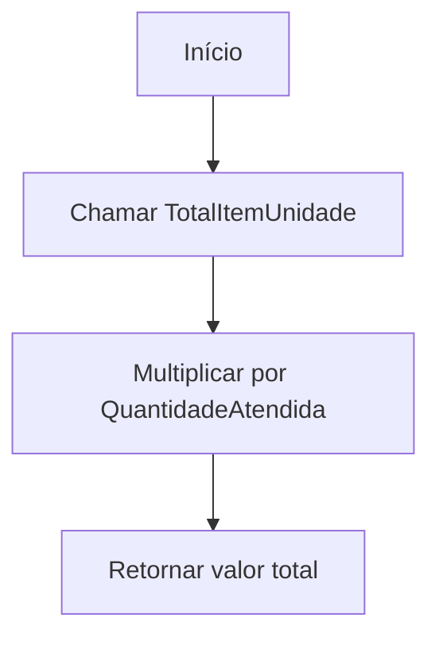
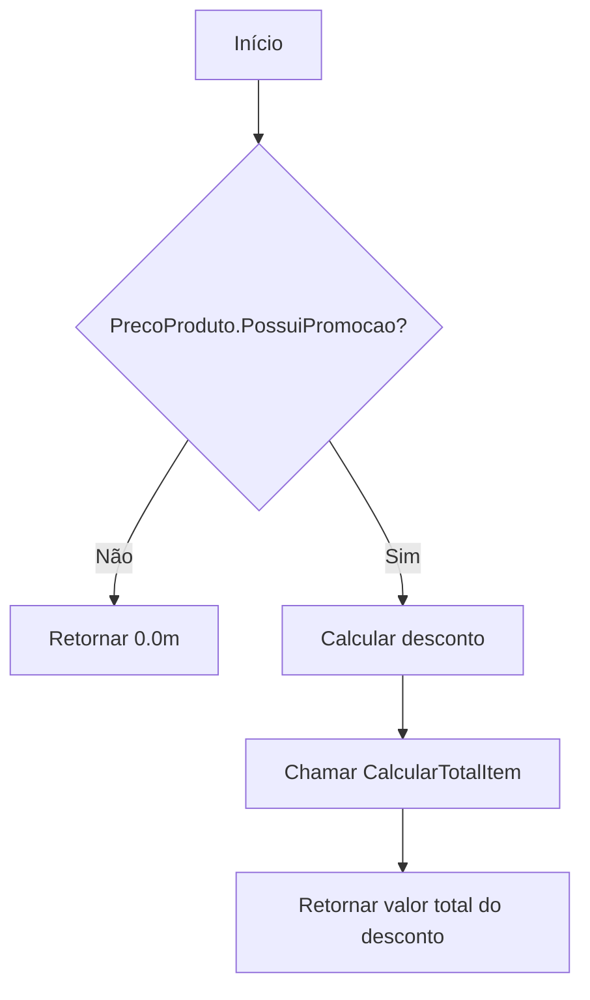
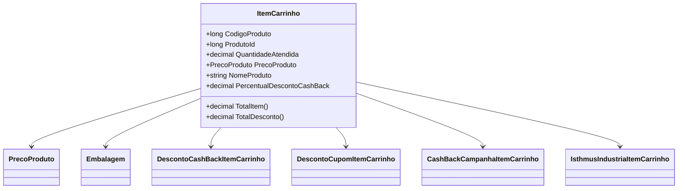

# ItemCarrinho

**Namespace**: IsthmusWinthor.Dominio.POCO.Carrinho  
**Nome do Arquivo**: ItemCarrinho.cs  

## Visão Geral e Responsabilidade
A classe `ItemCarrinho` representa um item dentro de um carrinho de compras, encapsulando toda a lógica necessária para calcular preços, descontos e outras propriedades relacionadas a vendas. Ela é fundamental para a gestão de itens em carrinhos, garantindo que os preços reflitam as condições de venda e descontos aplicáveis, e permitindo a manipulação e apresentação correta das informações para o usuário em um sistema de e-commerce.

## Métodos de Negócio

### TotalItemUnidade
- **Título**: `TotalItemUnidade` (public)
- **Objetivo**: Retornar o preço de venda unitário do produto, considerando regras de embalagem.
- **Comportamento**: 
  1. Obter o preço de venda do `PrecoProduto`.
  2. Chamado o método `CalcularTotalItem` com o preço unitário, que aplica regras e retorna o valor arredondado.
- **Retorno**: O preço unitário arredondado do item.

```mermaid
flowchart TD
    A[Início] --> B{PrecoProduto?}
    B -- Sim --> C[CalcularTotalItem(PrecoProduto.PrecoVenda)]
    B -- Não --> D[Retornar 0.0m]
    C --> E[Retornar preço arredondado]
    D --> E
```

### TotalItem
- **Título**: `TotalItem` (public)
- **Objetivo**: Calcular o valor total do item com base na quantidade atendida.
- **Comportamento**:
  1. Chamar `TotalItemUnidade` para obter o preço unitário.
  2. Multiplicar o preço unitário pela `QuantidadeAtendida`.
- **Retorno**: O valor total do item considerando a quantidade.



### TotalDesconto
- **Título**: `TotalDesconto` (public)
- **Objetivo**: Calcular o total de desconto aplicado ao item.
- **Comportamento**:
  1. Verificar se o `PrecoProduto` possui promoção.
  2. Se não houver promoção, retornar 0.
  3. Caso contrário, calcular o desconto baseado na diferença entre `PrecoCliente` e `PrecoPromocional`.
  4. Chamar `CalcularTotalItem` e multiplicar pela `QuantidadeAtendida`.
- **Retorno**: O valor total do desconto aplicado ao item.



### TotalItemBase
- **Título**: `TotalItemBase` (public)
- **Objetivo**: Calcular o total do item com base no preço sem impostos.
- **Comportamento**: Similar ao `TotalItem`, mas usa `PrecoBase` ao invés de `PrecoVenda`.
- **Retorno**: O total do item sem impostos.

### TotalItemPrecoCliente
- **Título**: `TotalItemPrecoCliente` (public)
- **Objetivo**: Calcular o total do item com base no preço do cliente.
- **Comportamento**: Utilize `PrecoCliente` no cálculo, similar ao anterior.
- **Retorno**: O total baseado no preço do cliente.

### TotalItemPrecoPromocional
- **Título**: `TotalItemPrecoPromocional` (public)
- **Objetivo**: Calcular total do item utilizando o preço promocional.
- **Comportamento**: Utiliza `PrecoPromocional`, seguindo lógica similar aos métodos anteriores.
- **Retorno**: O total do item com preço promocional.

### TotalDescontoCashBack
- **Título**: `TotalDescontoCashBack` (public)
- **Objetivo**: Calcular o total de desconto de cashback aplicado.
- **Comportamento**: Soma todos os valores de cashback em `CashBackDescontos`.
- **Retorno**: Valor total dos descontos de cashback.

## Propriedades Calculadas e de Validação

### TipoPlanoPagamento
- **Regra**: Define o tipo de plano de pagamento com base no grupo de faturamento.
- **Cálculo**: Através de `Entidades.PlanoPagamento.TipoPlanoPagamentoProduto`.

### PercentualDescontoCashBack
- **Regra**: Calcula o percentual de desconto de cashback aplicado ao item.
- **Cálculo**: `(TotalDescontoCashBack * 100) / totalItem`, arredondado e com limites de 0% a 100%.

## Navigations Property
- `[PrecoProduto](PrecoProduto.md)`
- `[Embalagem](Embalagem.md)`
- `[DescontoCashBackItemCarrinho](DescontoCashBackItemCarrinho.md)`
- `[DescontoCupomItemCarrinho](DescontoCupomItemCarrinho.md)`
- `[CashBackCampanhaItemCarrinho](CashBackCampanhaItemCarrinho.md)`
- `[IsthmusIndustriaItemCarrinho](IsthmusIndustriaItemCarrinho.md)`

## Tipos Auxiliares e Dependências
- `[TipoPlanoPagamento](TipoPlanoPagamento.md)`
- `[TipoRestricaoTransporte](TipoRestricaoTransporte.md)`

## Diagrama de Relacionamentos

