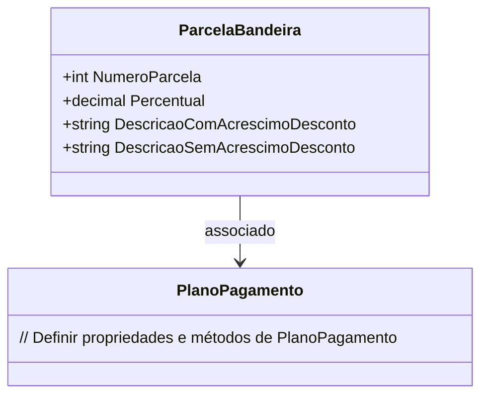

# ParcelaBandeira
**Namespace**: IsthmusWinthor.Dominio.POCO.Carrinho  
**Nome do Arquivo**: ParcelaBandeira.cs  

## Visão Geral e Responsabilidade
A classe `ParcelaBandeira` representa uma parcela de pagamento em um plano de pagamento específico. O seu papel é gerenciar as informações relativas a cada parcela, como número da parcela e percentual de acréscimo ou desconto, e gerar descrições formatadas desses dados. Este modelo de domínio é fundamental para lidar com as condições de pagamento em um sistema financeiro, assegurando que as informações exibidas reflitam corretamente eventuais acréscimos ou descontos.

## Métodos de Negócio

### Título: `DescricaoPercentual` (Privado)
- **Objetivo**: Garantir que a descrição associada ao percentual da parcela reflita corretamente se há um acréscimo ou desconto a ser aplicado.
- **Comportamento**:
  1. Verifica se o percentual é maior que 0.
  2. Se for positivo, retorna a string indicando o acréscimo com o percentual.
  3. Se o percentual for negativo, retorna a string indicando o desconto com o percentual absoluto.
  4. Se o percentual for 0, retorna uma string vazia.
- **Retorno**: Uma string que descreve o percentual conforme o estado (acréscimo, desconto ou nenhum).

```mermaid
flowchart TD
    A[Inicio] --> B{Percentual > 0}
    B -- Sim --> C[Retornar "Acréscimo de X%"]
    B -- Não --> D{Percentual < 0}
    D -- Sim --> E[Retornar "Desconto de Y%"]
    D -- Não --> F[Retornar ""]
```

## Propriedades Calculadas e de Validação

### Propriedades com Lógica
- **DescricaoComAcrescimoDesconto**: Formata a string para exibir o número da parcela junto com a descrição do percentual, se houver.
- **DescricaoSemAcrescimoDesconto**: Gera uma string simples informando que o pagamento será realizado em X parcelas, sem considerar o percentual.

## Navigations Property
- **PlanoPagamento**: Representa a classe de plano de pagamento associada.  
  - [PlanoPagamento](PlanoPagamento.md)

## Tipos Auxiliares e Dependências
- Nenhum enumerador ou classe auxiliar específica utilizada na implementação desta classe. 

## Diagrama de Relacionamentos


Esta documentação apresenta uma visão clara da classe `ParcelaBandeira`, focando na lógica de negócio, regras de validação e interações com outras classes no domínio, assegurando que integridade dos dados e regras sejam mantidas em qualquer contexto em que esta classe seja utilizada.
---
Gerada em 29/12/2025 21:42:16
