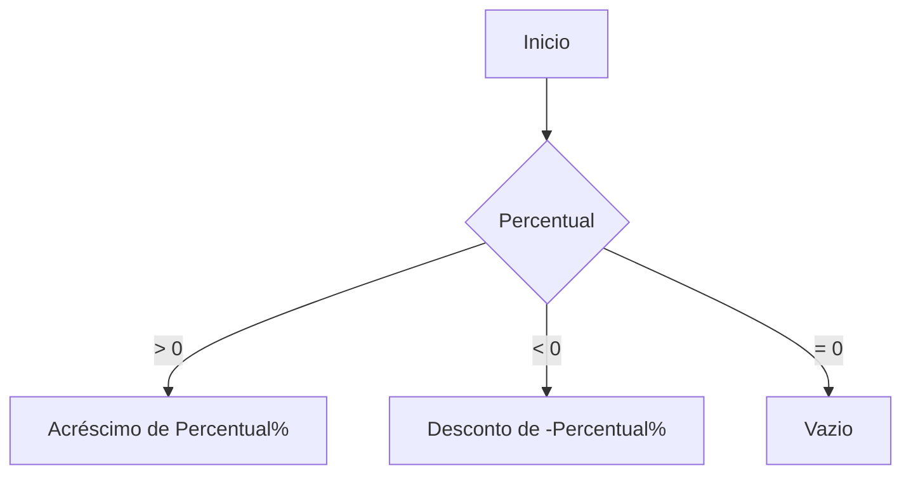
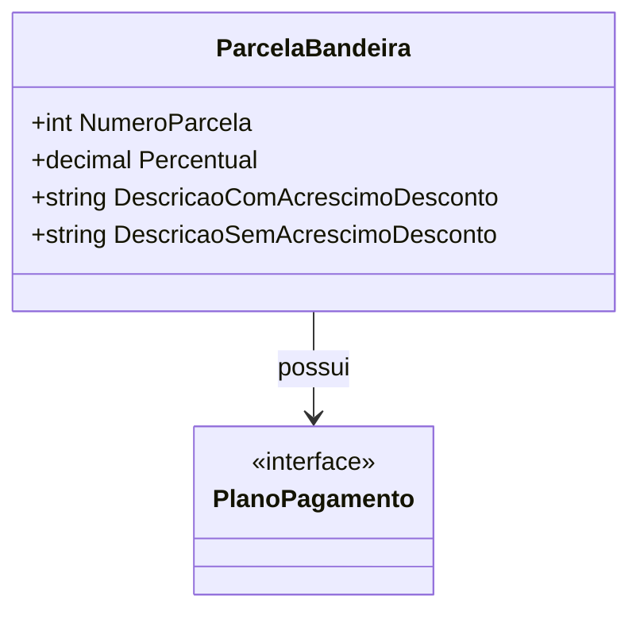

# ParcelaBandeira
**Namespace**: IsthmusWinthor.Dominio.POCO.Carrinho  
**Nome do Arquivo**: ParcelaBandeira.cs  

## Visão Geral e Responsabilidade
A classe `ParcelaBandeira` representa a estrutura de uma parcela de pagamento que pode incluir acréscimos ou descontos percentuais. O objetivo desta classe é resolver o problema de apresentação clara e formatada das condições de pagamento em várias parcelas, facilitando a compreensão dos usuários sobre como os pagamentos serão aplicados ao longo do tempo, bem como as consequências financeiras resultantes de cada opção de parcelamento.

## Métodos de Negócio

### Título: `DescricaoPercentual` (Privado)
**Objetivo**: Garante que a descrição da parcela inclua informações sobre acréscimos ou descontos de forma condicional.  
**Comportamento**: 
1. Avalia o valor de `Percentual`.
2. Se `Percentual` é maior que zero, retorna uma string indicando um acréscimo.
3. Se `Percentual` é menor que zero, retorna uma string indicando um desconto.
4. Se `Percentual` é igual a zero, retorna uma string vazia.
   
**Retorno**: Uma string representando o acréscimo ou desconto percentual que será aplicado, ou uma string vazia se não houver.

## Propriedades Calculadas e de Validação

### `DescricaoComAcrescimoDesconto`
Essa é uma propriedade calculada que gera uma string formatada que combina o número da parcela com a descrição do percentual, utilizando o método `DescricaoPercentual` para determinar se há um acréscimo ou desconto.

### `DescricaoSemAcrescimoDesconto`
Essa propriedade fornece uma string simples que indica a contagem de parcelas em um pagamento, sem considerar valores adicionais.

## Navigations Property

### `PlanoPagamento`
- [PlanoPagamento](PlanoPagamento.md): Representa o plano de pagamento associado a esta parcela.

## Tipos Auxiliares e Dependências
- Nenhum enumerador ou classe auxiliar está diretamente associado a esta classe.

## Diagrama de Relacionamentos

