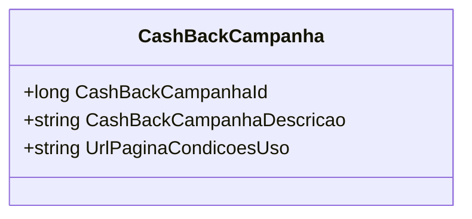

# CashBackCampanha
**Namespace**: IsthmusWinthor.Dominio.POCO  
**Nome do Arquivo**: CashBackCampanha.cs  

> A classe `CashBackCampanha` serve como um objeto de transporte de dados para a campanha de cashback, contendo detalhes sobre a campanha e as condições de uso.

### Propriedades
- **CashBackCampanhaId**: Identificador único da campanha de cashback.
- **CashBackCampanhaDescricao**: Descrição da campanha de cashback.
- **UrlPaginaCondicoesUso**: URL para as condições de uso da campanha de cashback.  

### Tipos Auxiliares e Dependências
Nenhum tipo auxiliar ou dependência é utilizado nesta classe.  

### Diagrama de Relacionamentos

