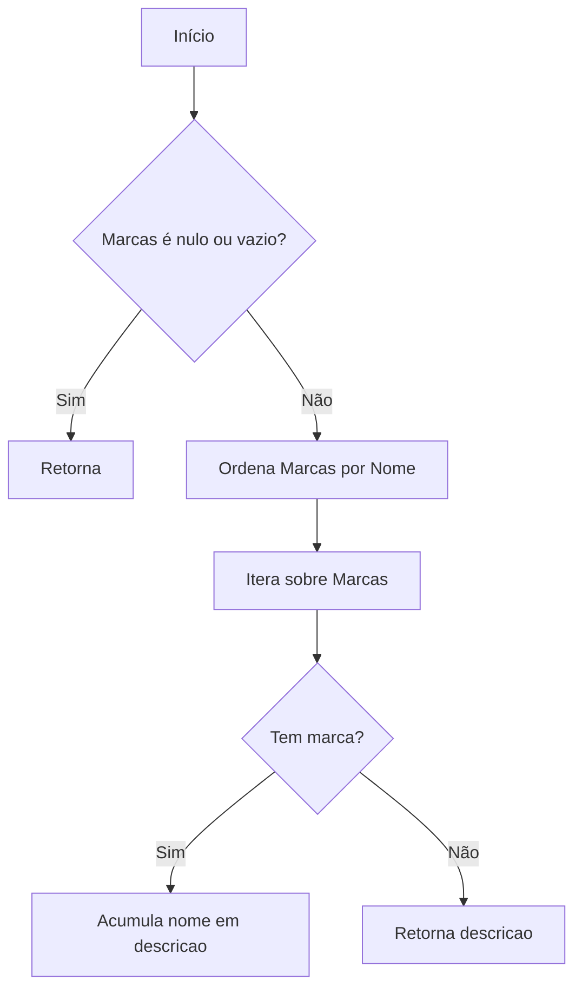
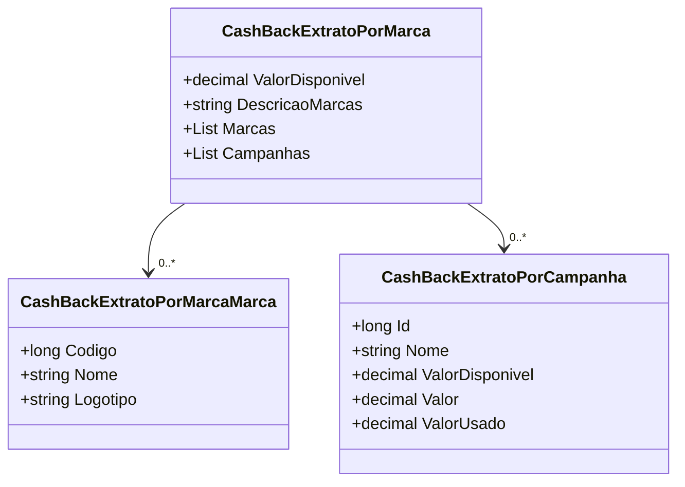

# CashBackExtratoPorMarca
**Namespace**: IsthmusWinthor.Dominio.POCO  
**Nome do Arquivo**: CashBackExtratoPorMarca.cs  

## Visão Geral e Responsabilidade
A classe `CashBackExtratoPorMarca` representa um extrato de cashback, associando valores disponíveis a diversas marcas e campanhas. Sua responsabilidade principal é consolidar as informações sobre o cashback disponível e fornecer uma descrição legível das marcas envolvidas.

## Métodos de Negócio

### Título: `DescricaoMarcas` (Visibilidade: Public)
- **Objetivo**: Garante que a descrição das marcas associadas ao extrato de cashback seja formatada corretamente, permitindo fácil visualização para o usuário final.
- **Comportamento**:
  1. Verifica se a lista de marcas (`Marcas`) é nula ou vazia.
  2. Se for nula ou vazia, retorna uma string vazia.
  3. Caso contrário, ordena as marcas por nome.
  4. Itera sobre as marcas ordenadas e as acumula em uma string, separando por " / ".
  5. Retorna a string que contém a descrição formatada das marcas.
- **Retorno**: Retorna uma string que representa a descrição formatada das marcas ou uma string vazia se não houver marcas.

## Propriedades Calculadas e de Validação
### Propriedade: `DescricaoMarcas`
- **Regra**: Esta propriedade computa uma lista de nomes de marcas disponíveis, garantindo que a saída esteja formatada corretamente. Se não houver marcas, ela retorna uma string vazia.

## Navigations Property
- `Marcas`: Lista de objetos do tipo `[CashBackExtratoPorMarcaMarca](CashBackExtratoPorMarcaMarca.md)`, representando as marcas associadas ao cashback.
- `Campanhas`: Lista de objetos do tipo `[CashBackExtratoPorCampanha](CashBackExtratoPorCampanha.md)`, representando as campanhas associadas ao cashback.

## Tipos Auxiliares e Dependências
- `CashBackExtratoPorMarcaMarca`: Utilizada para representar informações sobre cada marca no extrato. ([CashBackExtratoPorMarcaMarca](CashBackExtratoPorMarcaMarca.md))
- `CashBackExtratoPorCampanha`: Utilizada para representar as campanhas relacionadas. ([CashBackExtratoPorCampanha](CashBackExtratoPorCampanha.md))

## Diagrama de Relacionamentos

