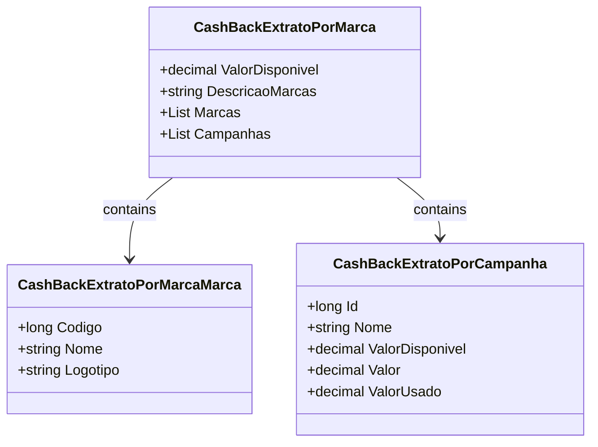

# CashBackExtratoPorMarca
**Namespace**: IsthmusWinthor.Dominio.POCO  
**Nome do Arquivo**: CashBackExtratoPorMarca.cs  

## Visão Geral e Responsabilidade
A classe `CashBackExtratoPorMarca` representa o extrato de cashback disponível por marca. Seu papel é consolidar os valores disponíveis e as marcas associadas, permitindo que os usuários visualizem de forma clara as informações sobre cashback. Ela resolve o problema de diferenciação de cashback disponível por marcas, facilitando o entendimento das ofertas de cashback que um usuário pode aproveitar.

## Métodos de Negócio

### Título: `DescricaoMarcas` (Público)
- **Objetivo**: Garante que a descrição das marcas disponíveis seja apresentada de maneira concatenada e ordenada.
- **Comportamento**:
  1. Verifica se a lista de marcas (`Marcas`) é null ou vazia.
  2. Caso seja, retorna uma string vazia.
  3. Se não for, inicializa um `StringBuilder` para começar a construir a descrição.
  4. Ordena as marcas pelo nome em ordem crescente.
  5. Para cada marca, verifica se já há uma descrição acumulada e, se sim, adiciona uma barra (`" / "`).
  6. Adiciona o nome da marca à descrição acumulada.
  7. Retorna a string resultante da descrição atualizada.
- **Retorno**: Uma string contendo os nomes das marcas disponíveis, separados por barra.

```mermaid
flowchart TD
    A[Inicio] --> B{Marcas == null ou Marcas vazia?}
    B -- Sim --> C[Retorna ""]
    B -- Não --> D[Inicia StringBuilder]
    D --> E[Ordena Marcas]
    E --> F[Para cada Marca]
    F --> G{Descricao.Length > 0?}
    G -- Sim --> H[Adiciona " / "]
    G -- Não --> I[Adiciona Marca.Nome]
    F --> J[Retorna descricao.ToString()]
```

## Propriedades Calculadas e de Validação

### Propriedade: `DescricaoMarcas`
- **Regra de Cálculo**: Concatena os nomes das marcas que estão presentes na lista `Marcas`, separando-os por " / " e garantindo que estão em ordem alfabética.

## Navigation Property
- `Marcas`: Lista de objetos da classe complexa [CashBackExtratoPorMarcaMarca](CashBackExtratoPorMarcaMarca.md), representando cada marca associada ao cashback.
- `Campanhas`: Lista de objetos da classe complexa [CashBackExtratoPorCampanha](CashBackExtratoPorCampanha.md), representando as campanhas de cashback disponíveis.

## Tipos Auxiliares e Dependências
- Classe Complexa: 
  - [CashBackExtratoPorMarcaMarca](CashBackExtratoPorMarcaMarca.md)
  - [CashBackExtratoPorCampanha](CashBackExtratoPorCampanha.md)

## Diagrama de Relacionamentos

---
Gerada em 29/12/2025 21:29:24
