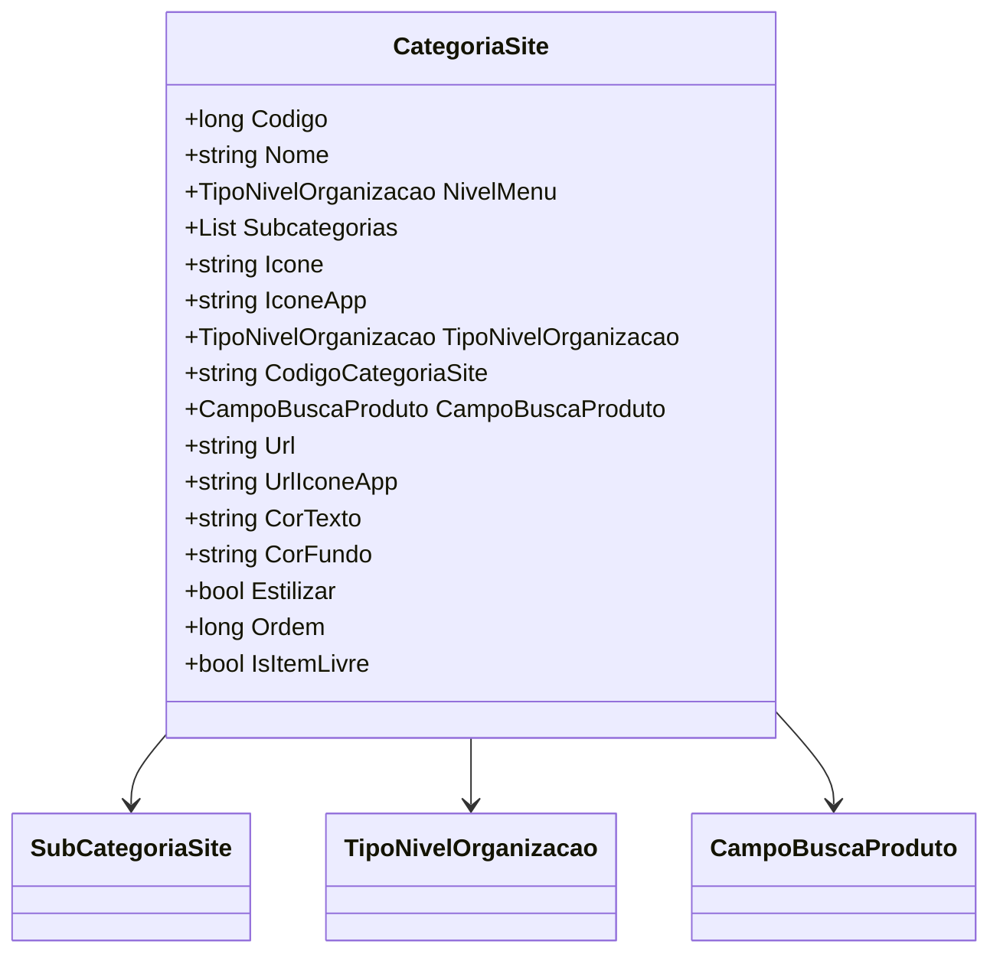

# CategoriaSite
- **Namespace**: IsthmusWinthor.Dominio.POCO
- **Nome do Arquivo**: CategoriaSite.cs

## Visão Geral e Responsabilidade
A classe `CategoriaSite` representa uma categoria no contexto de um sistema de categorização de produtos em um site. Seu papel é organizar subcategorias e fornecer informações relacionadas a como essa categoria é exibida, incluindo propriedades visuais como ícones e cores. Essa estrutura é essencial para garantir que os produtos estejam logicamente agrupados e facilmente acessíveis aos usuários, ajudando na navegação e na busca de produtos.

## Propriedades Calculadas e de Validação
- `NivelMenu`: Retorna o valor `TipoNivelOrganizacao.Categoria`, representando o nível da organização para categorias.

## Navigations Property
- `Subcategorias`: Lista de subcategorias associadas a esta categoria. 
   - Presumido que a classe esteja em `[SubCategoriaSite](SubCategoriaSite.md)`.

## Tipos Auxiliares e Dependências
- `TipoNivelOrganizacao`: Enum que define os diferentes tipos de níveis de organização. [TipoNivelOrganizacao](TipoNivelOrganizacao.md).
- `CampoBuscaProduto`: Classe utilizada para definir as características de busca de produtos.

## Diagrama de Relacionamentos

