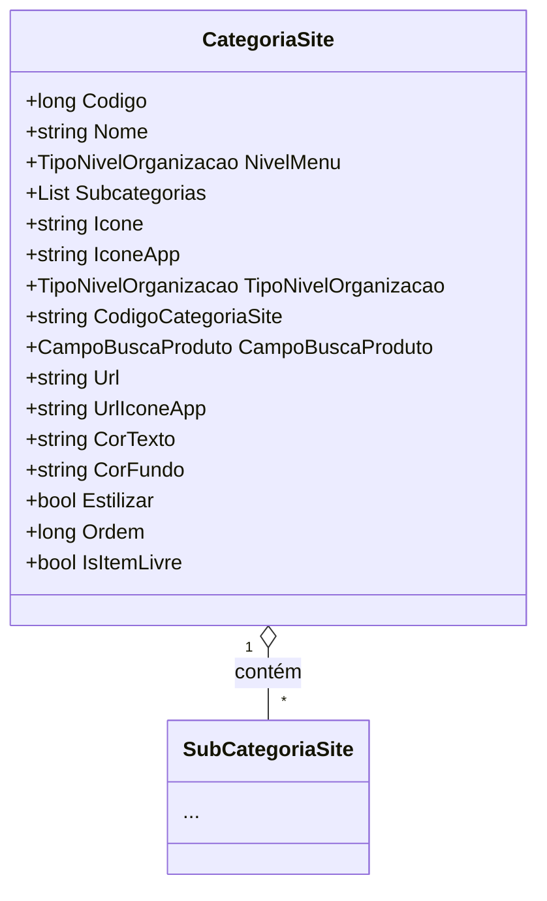

# CategoriaSite
**Namespace**: IsthmusWinthor.Dominio.POCO  
**Nome do Arquivo**: CategoriaSite.cs  

## Visão Geral e Responsabilidade
A classe `CategoriaSite` representa uma categoria dentro do sistema, utilizada em um contexto de menu de site. Ela é responsável por agrupar subcategorias de produtos, facilitar a busca de produtos e determinar a apresentação visual da categoria no frontend. A classe direciona o comportamento da exibição de informações e a categorização dos produtos, solucionando o problema de organização e navegação no site.

## Propriedades Calculadas e de Validação
- **NivelMenu**: Retorna o tipo de nível de organização como `TipoNivelOrganizacao.Categoria`, que indica que esta instância representa uma categoria no sistema.
- **CampoBuscaProduto**: Pode incluir lógica de validação relacionada ao formato dos campos permitidos para busca de produtos associados à categoria.

## Navigations Property
- **Subcategorias**: Propriedade que representa uma lista de subcategorias relacionadas à `CategoriaSite`.  
  - [SubCategoriaSite](SubCategoriaSite.md)

## Tipos Auxiliares e Dependências
- **Enumeradores**: 
  - [TipoNivelOrganizacao](TipoNivelOrganizacao.md)
  
## Diagrama de Relacionamentos

---
Gerada em 29/12/2025 21:29:32
