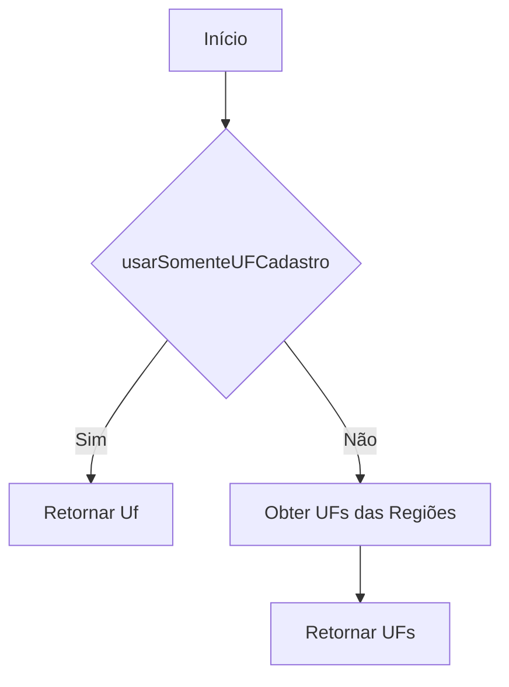
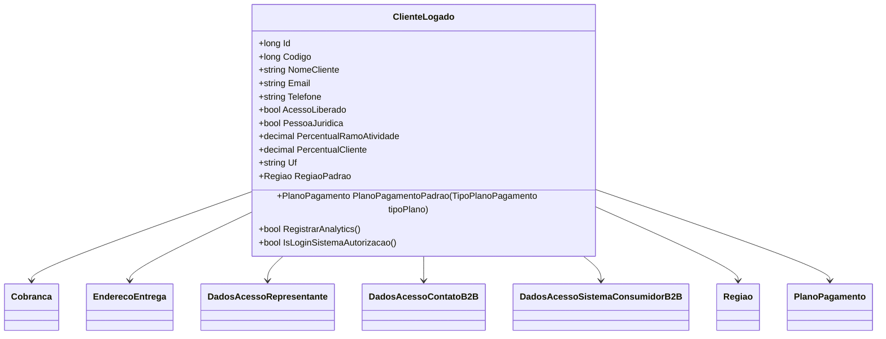

# ClienteLogado
**Namespace**: IsthmusWinthor.Dominio.POCO  
**Nome do Arquivo**: ClienteLogado.cs  

## Visão Geral e Responsabilidade
A classe `ClienteLogado` representa um cliente que está autenticado no sistema e contém informações detalhadas sobre ele, incluindo dados pessoais, informações de contato e configurações específicas de acesso. Esta classe é crucial para gerenciar o estado do cliente em interações com a plataforma, permitindo a aplicação de regras de negócios como gerenciamento de permissões de acesso e configuração de planos de pagamento, essencial para o seu funcionamento.

## Métodos de Negócio

### RegistrarAnalytics
- **Objetivo**: Determina se o cliente possui permissão para registrar análises com base em seu perfil de login.
- **Comportamento**: Avalia se o `PerfilLogin` é do tipo `Cliente` ou `ContatoB2B`. Se for, o método retorna `true`, indicando a capacidade de registrar análises; caso contrário, retorna `false`.
- **Retorno**: `bool` que indica se o cliente pode registrar analytics.

### ObterUFsParaCampanhas
- **Objetivo**: Recupera as UFs (Unidades Federativas) aplicáveis para campanhas de marketing.
- **Comportamento**: Verifica se a opção `usarSomenteUFCadastro` está habilitada. Se sim, retorna uma lista contendo somente a UF do cliente. Caso contrário, retorna uma lista com as UFs das regiões associadas ao cliente.
- **Retorno**: `IEnumerable<string>` com as UFs que podem ser utilizadas nas campanhas.

### PlanoPagamentoPadrao
- **Objetivo**: Fornece o plano de pagamento padrão baseado no tipo especificado.
- **Comportamento**: Procura na lista de `PlanosPagamentoPadroes` pelo plano que corresponde ao `tipoPlano` recebido. Caso nenhum plano correspondente seja encontrado, retorna o plano padrão.
- **Retorno**: `PlanoPagamento` correspondente ao tipo solicitado ou um plano padrão.

### IsLoginSistemaAutorizacao
- **Objetivo**: Verifica se o login realizado é através do sistema de autorização ou chatbot.
- **Comportamento**: Avalia se o `PerfilLogin` é igual a `Autorizacao` ou `Chatbot` e se `DadosAcessoSistemaConsumidorB2B` não é nulo. Retorna `true` se ambas as condições forem atendidas.
- **Retorno**: `bool` que indica se o login é um login de sistema de autorização.

## Propriedades Calculadas e de Validação

### PerfilLoginCarrinhoCompras
- **Regra**: Retorna `Cliente` se o `PerfilLogin` for `Chatbot`; caso contrário, retorna o valor atual de `PerfilLogin`.

### IdentificadoPerfilCarrinhoCompras
- **Regra**: Retorna `IdentificadoPerfilCliente` caso não esteja vazio e se o `PerfilLogin` for `Chatbot`; do contrário, retorna `IdentificadoPerfilLogin`.

## Navigations Property
- `[Cobranca](Cobranca.md)`
- `[EnderecoEntrega](EnderecoEntrega.md)`
- `[DadosAcessoRepresentante](DadosAcessoRepresentante.md)`
- `[DadosAcessoContatoB2B](DadosAcessoContatoB2B.md)`
- `[DadosAcessoSistemaConsumidorB2B](DadosAcessoSistemaConsumidorB2B.md)`
- `[Regiao](Regiao.md)`
- `[PlanoPagamento](PlanoPagamento.md)`

## Tipos Auxiliares e Dependências
- `[PerfilLoginEnum](PerfilLoginEnum.md)`
- `[TipoPlanoPagamento](TipoPlanoPagamento.md)`
- `[ERPEnum](ERPEnum.md)`
- `[TipoVendedor](TipoVendedor.md)`

## Diagrama de Relacionamentos

