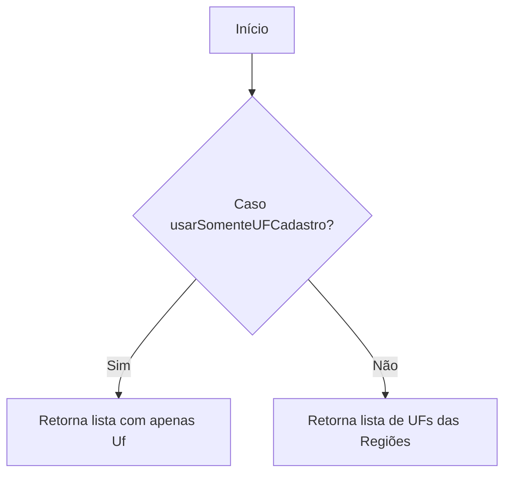
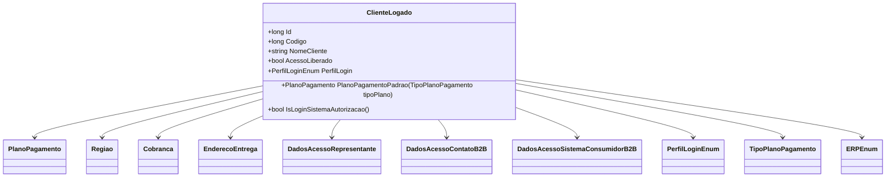

# ClienteLogado
- **Namespace**: IsthmusWinthor.Dominio.POCO
- **Nome do Arquivo**: ClienteLogado.cs

## Visão Geral e Responsabilidade
A classe `ClienteLogado` representa um cliente autenticado no sistema, armazenando informações detalhadas sobre sua identidade, perfil e condições de venda. Ela é fundamental para controlar o acesso às funcionalidades do sistema e garantir que a lógica de precificação e regras de negócios sejam aplicadas corretamente, de acordo com a natureza do cliente e suas preferências.

## Métodos de Negócio

### Título: ObterUFsParaCampanhas (private)
- **Objetivo**: Garante que as campanhas sejam aplicadas apenas às unidades federativas corretas, levando em consideração condições específicas do cadastro do cliente.
- **Comportamento**: 
  1. Verifica a condição de `usarSomenteUFCadastro`.
  2. Se for verdadeiro, retorna uma lista contendo apenas a unidade federativa (`Uf`) do cliente.
  3. Se for falso, retorna uma lista de todas as unidades federativas associadas às regiões do cliente, através da propriedade `Regioes`.
- **Retorno**: Retorna uma coleção de strings representando as unidades federativas que podem ser usadas nas campanhas.

### Título: RegistrarAnalytics
- **Objetivo**: Determina se as informações de analytics devem ser registradas com base no perfil do cliente.
- **Comportamento**: 
  1. Verifica se o `PerfilLogin` é `Cliente` ou `ContatoB2B`.
  2. Retorna verdadeiro se a condição for atendida, caso contrário, retorna falso.
- **Retorno**: Retorna um valor booleano que indica se o cliente está em um perfil que permite o registro de analytics.

### Título: PlanoPagamentoPadrao
- **Objetivo**: Retorna o plano de pagamento padrão para o cliente com base no tipo solicitado.
- **Comportamento**:
  1. Pesquisa na lista `PlanosPagamentoPadroes` pelo plano que corresponde ao `tipoPlano` fornecido.
  2. Se não encontrar nenhuma correspondência, retorna o plano de pagamento padrão.
- **Retorno**: Retorna um objeto `PlanoPagamento` correspondente ao tipo solicitado ou o plano padrão se não houver correspondência.

### Título: IsLoginSistemaAutorizacao
- **Objetivo**: Identifica se o login atual está utilizando o sistema de autorização.
- **Comportamento**:
  1. Verifica se o `PerfilLogin` é `Autorizacao` ou `Chatbot`.
  2. Confirma se `DadosAcessoSistemaConsumidorB2B` não é nulo.
- **Retorno**: Retorna um valor booleano que indica se o login foi efetuado através do sistema de autorização.

## Propriedades Calculadas e de Validação

### `PerfilLoginCarrinhoCompras`
- **Regra**: Se o `PerfilLogin` for `Chatbot`, deve retornar `Cliente` para o perfil na lógica de carrinho de compras. Caso contrário, retorna o `PerfilLogin` atual.

### `IdentificadoPerfilCarrinhoCompras`
- **Regra**: Se `IdentificadoPerfilCliente` estiver preenchido e o `PerfilLogin` for `Chatbot`, retorna `IdentificadoPerfilCliente`, caso contrário retorna `IdentificadoPerfilLogin`.

## Navigations Property
- [PlanoPagamento](PlanoPagamento.md)
- [Regiao](Regiao.md)
- [Cobranca](Cobranca.md)
- [EnderecoEntrega](EnderecoEntrega.md)
- [DadosAcessoRepresentante](DadosAcessoRepresentante.md)
- [DadosAcessoContatoB2B](DadosAcessoContatoB2B.md)
- [DadosAcessoSistemaConsumidorB2B](DadosAcessoSistemaConsumidorB2B.md)
- [RegiaoPadrao](Regiao.md) 

## Tipos Auxiliares e Dependências
- [PerfilLoginEnum](PerfilLoginEnum.md)
- [TipoPlanoPagamento](TipoPlanoPagamento.md)
- [TipoVendedor](TipoVendedor.md)
- [ERPEnum](ERPEnum.md)
- [Regiao](Regiao.md)

## Diagrama de Relacionamentos

---
Gerada em 29/12/2025 21:29:58
