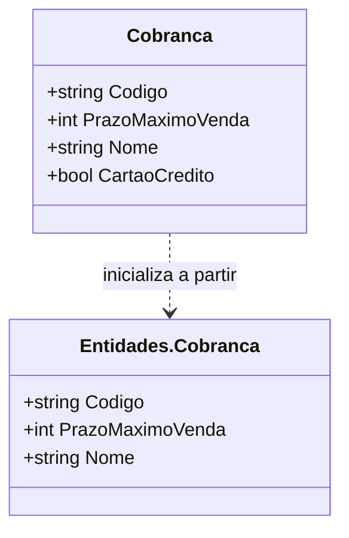

# Cobranca
**Namespace**: IsthmusWinthor.Dominio.POCO  
**Nome do Arquivo**: Cobranca.cs  

---

### Citação
A classe `Cobranca` é um DTO responsável por transportar dados relacionados à cobrança de um produto ou serviço dentro do sistema.

---

### Propriedades

- `Codigo`: Código único da cobrança.
- `PrazoMaximoVenda`: Prazo máximo em dias que um produto pode ser vendido.
- `Nome`: Nome da cobrança.
- `CartaoCredito`: Indica se o pagamento pode ser realizado via cartão de crédito.

---

### Construtores

- `Cobranca()`: Construtor padrão da classe.
- `Cobranca(Entidades.Cobranca cob)`: Construtor que inicializa a classe a partir de uma instância de `Entidades.Cobranca`, populando suas propriedades.

---

### Tipos Auxiliares e Dependências

- `Entidades.Cobranca`: Referência à classe que fornece os dados utilizados na inicialização da classe `Cobranca`.

---

### Diagrama de Relacionamentos

--- 

Esta documentação reflete a estrutura e a finalidade da classe `Cobranca`, destacando suas responsabilidades dentro do sistema e suas interações com outras entidades.
