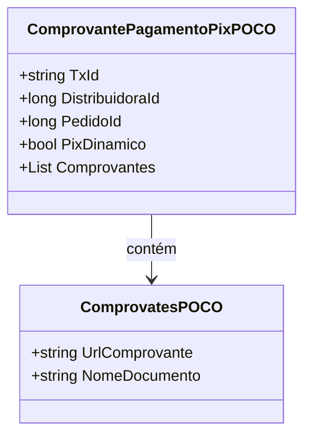
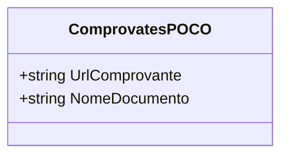

# ComprovantePagamentoPixPOCO
**Namespace**: IsthmusWinthor.Dominio.POCO  
**Nome do Arquivo**: ComprovantePagamentoPixPOCO.cs  

## Visão Geral e Responsabilidade
A classe `ComprovantePagamentoPixPOCO` tem a responsabilidade de representar um comprovante de pagamento realizado através do sistema de pagamento PIX. Ela encapsula todos os dados necessários para a verificação e validação deste pagamento, atuando como um objeto de transferência de dados (DTO) no domínio, facilitando a manipulação e a integridade dos dados de pagamentos.

## Métodos de Negócio
### Nenhum método presente.
- A classe atua principalmente como um DTO, portanto, não contém métodos com lógica de negócio.

## Propriedades Calculadas e de Validação
### Propriedades
- `PxDinamico` (bool): Indica se a transação foi realizada com um código PIX dinâmico. Não há uma lógica de validação ou cálculo além do simples armazenamento do valor.
- `Comprovantes` (List<ComprovatesPOCO>): Uma lista que armazena os comprovantes associados ao pagamento. Não há validação ou cálculo nas propriedades.

## Navigations Property
- `Comprovantes` (List<ComprovatesPOCO>): Representa a associação com a classe [ComprovatesPOCO](ComprovatesPOCO.md), que contém informações detalhadas sobre cada comprovante gerado.

## Tipos Auxiliares e Dependências
- [ComprovatesPOCO](ComprovatesPOCO.md): Classe que encapsula os detalhes de cada comprovante, incluindo a URL e o nome do documento associado ao pagamento.

## Diagrama de Relacionamentos

---

# ComprovatesPOCO
**Namespace**: IsthmusWinthor.Dominio.POCO  
**Nome do Arquivo**: ComprovatesPOCO.cs  

## Visão Geral e Responsabilidade
A classe `ComprovatesPOCO` representa os dados de um comprovante de pagamento, contendo informações relevantes como a URL do comprovante e o nome do documento. Essa classe é utilizada como parte do `ComprovantePagamentoPixPOCO` para agrupar múltiplos comprovantes associados a uma única transação.

## Métodos de Negócio
### Nenhum método presente.
- A classe atua principalmente como um DTO, não possuindo métodos com lógica associada.

## Propriedades Calculadas e de Validação
### Propriedades
- `UrlComprovante` (string): Armazena a URL que aponta para o comprovante de pagamento. Não há validação ou lógica de cálculo.
- `NomeDocumento` (string): Nome do documento do comprovante. Também não possui regras de validação ou cálculo.

## Navigations Property
- Nenhuma propriedade complexa: a classe é composta exclusivamente de dados primitivos.

## Tipos Auxiliares e Dependências
- Nenhum tipo auxiliar ou enum definido.

## Diagrama de Relacionamentos

A documentação técnica acima fornece uma visão clara da estrutura de classes e suas responsabilidades, ajudando no entendimento do sistema e na manutenção do código no futuro.
---
Gerada em 29/12/2025 21:30:15
