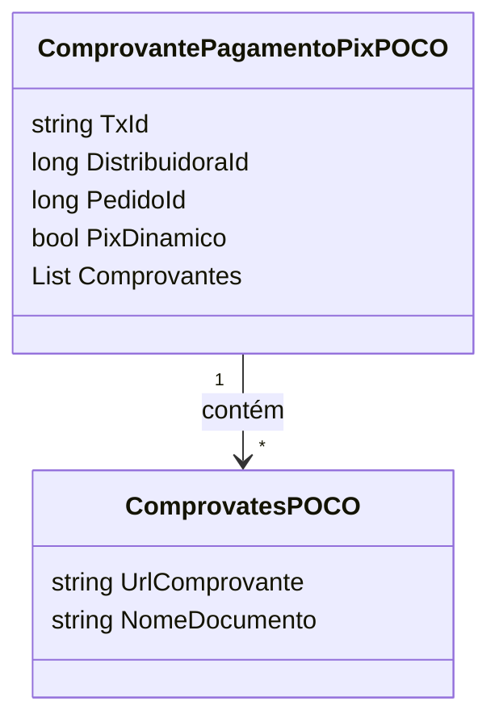

# ComprovantePagamentoPixPOCO
**Namespace**: IsthmusWinthor.Dominio.POCO  
**Nome do Arquivo**: ComprovantePagamentoPixPOCO.cs  

## Visão Geral e Responsabilidade
A classe `ComprovantePagamentoPixPOCO` atua como uma representação do comprovante de pagamento realizado via Pix. Ela encapsula os dados necessários que atestam a transação, incluindo a identificação do pagamento e detalhes do pedido relacionado. Esta classe é fundamental para assegurar que o processo de validação dos pagamentos ocorra de forma organizada e verificável, promovendo a integridade dos dados transacionais no sistema de gestão de pagamentos.

## Métodos de Negócio
Neste contexto, a classe `ComprovantePagamentoPixPOCO` não apresenta métodos específicos com lógica complexa ou regras de negócio a serem documentadas. Portanto, nenhuma documentação de métodos de negócio é necessária.

## Propriedades Calculadas e de Validação
A classe não possui propriedades com lógica complexa no `get` ou validação no `set`. Todas as propriedades são anêmicas, servindo somente para transporte de dados.

## Navigations Property
- `Comprovantes`: Esta é uma coleção de instâncias da classe `ComprovatesPOCO`, que representam documentos associados ao comprovante de pagamento.  
  - [ComprovatesPOCO](ComprovatesPOCO.md)

## Tipos Auxiliares e Dependências
A classe utiliza as seguintes classes auxiliares:
- [ComprovatesPOCO](ComprovatesPOCO.md)

## Diagrama de Relacionamentos

