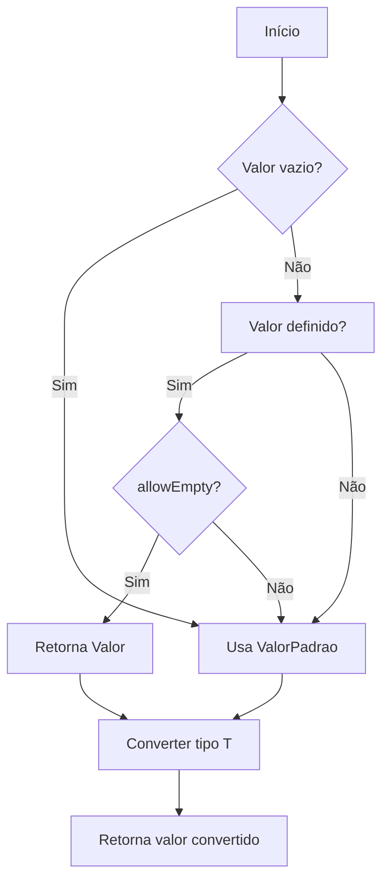
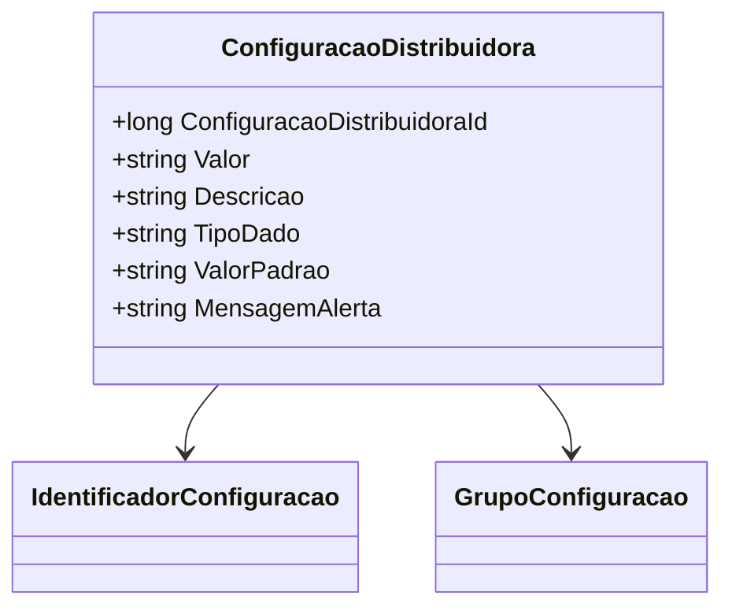

# ConfiguracaoDistribuidora
**Namespace**: IsthmusWinthor.Dominio.POCO  
**Nome do Arquivo**: ConfiguracaoDistribuidora.cs  

## Visão Geral e Responsabilidade
A classe `ConfiguracaoDistribuidora` representa a configuração de dados que pode ser definida por um distribuidor dentro do sistema. Ela provê uma maneira de armazenar, gerenciar e recuperar parâmetros de configuração, permitindo que valores padrão sejam utilizados ou que valores definidos pelo distribuidor sejam utilizados, considerando regras específicas para tratamento de valores vazios. Essa funcionalidade é crucial para garantir a flexibilidade e a personalização da configuração, assegurando que o sistema opere conforme as definições e expectativas dos distribuidores.

## Métodos de Negócio

### Título: Get<T>() [public]
- **Objetivo**: Este método garante que os valores retornados sejam adequadamente convertidos para o tipo solicitado, respeitando as regras de tratamento de valores vazios e padrão. 
- **Comportamento**: 
  1. O método inicia buscando o `Valor` da propriedade da classe.
  2. Se `Valor` for nulo ou vazio, ele define `valor` como o `ValorPadrao`.
  3. Se o parâmetro `allowEmpty` for verdadeiro e `Valor` não for nulo, ele permite que `valor` seja o próprio `Valor` dado pelo distribuidor.
  4. O sistema tenta converter `valor` para o tipo `T` utilizando o método `Convert<T>()`.
- **Retorno**: Retorna o valor convertido para o tipo solicitado, ou o valor padrão do tipo se ocorrer qualquer erro durante o processo de conversão.

### Título: GetAsDecimal() [public]
- **Objetivo**: Este método fornece uma forma de garantir que o valor armazenado como string seja retornado de forma segura e convertida para um decimal, com tratamento para valores vazios.
- **Comportamento**: 
  1. O método verifica se `Valor` é nulo ou vazio.
  2. Caso seja, retorna 0.
  3. Tenta a conversão de `Valor` para decimal usando `decimal.TryParse()`.
- **Retorno**: Retorna o valor decimal resultante da conversão, ou 0 em caso de falha.

## Propriedades Calculadas e de Validação
- **Valor**: Não tem validações de set ou lógica computada por sua definição, mas sua manipulação ocorre nos métodos de negócio.
  
## Navigations Property
- `[IdentificadorConfiguracao](IdentificadorConfiguracao.md)`
- `[GrupoConfiguracao](GrupoConfiguracao.md)`

## Tipos Auxiliares e Dependências
- `[IdentificadorConfiguracao](IdentificadorConfiguracao.md)`
- `[GrupoConfiguracao](GrupoConfiguracao.md)`

## Diagrama de Relacionamentos

