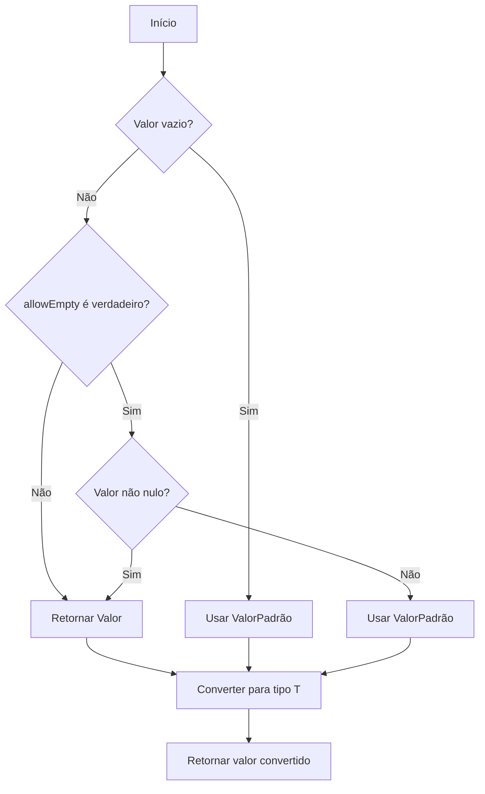
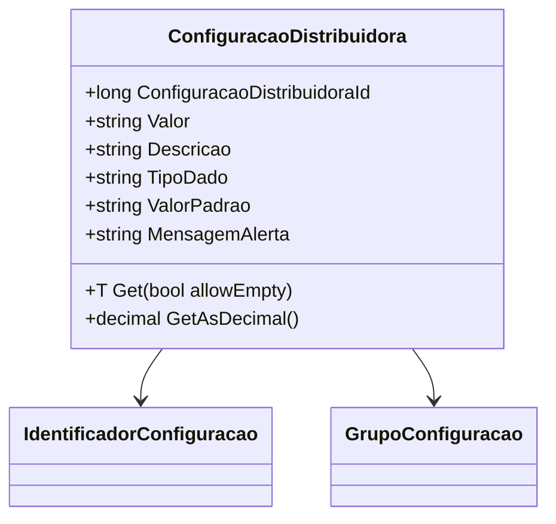

# ConfiguracaoDistribuidora
**Namespace**: IsthmusWinthor.Dominio.POCO  
**Nome do Arquivo**: ConfiguracaoDistribuidora.cs  

## Visão Geral e Responsabilidade
A classe `ConfiguracaoDistribuidora` representa as configurações específicas de uma distribuidora. Ela tem o propósito de armazenar e manipular parâmetros que podem ser utilizados em outras partes do sistema, permitindo flexibilidade na gestão desses dados. O problema de negócio que a classe resolve é a necessidade de parametrização de configurações que podem variar entre distribuidoras, permitindo a adaptação de funcionalidades a diferentes contextos operacionais.

## Métodos de Negócio

### Título: Get<T> (Public)
**Objetivo**: Este método garante que os parâmetros estejam disponíveis em diferentes tipos, respeitando a possibilidade de que os valores definidos possam ser vazios ou nulos.

**Comportamento**: 
1. Recupera o valor da propriedade `Valor`.
2. Se `Valor` estiver vazio, substitui pelo `ValorPadrao`.
3. Se `allowEmpty` for verdadeiro e `Valor` não for nulo, mantém o valor fornecido pelo distribuidor.
4. Chama o método `Convert<T>` para converter o valor para o tipo desejado `T`.
5. Se ocorrer uma exceção, registra o erro e retorna o valor padrão do tipo `T`.

### Título: GetAsDecimal (Public)
**Objetivo**: Este método fornece uma maneira de obter o valor armazenado como um decimal. Ele garante que, na ausência de um valor válido, um valor padrão (0) seja retornado.

**Comportamento**: 
1. Verifica se `Valor` está vazio.
2. Se estiver, retorna 0.
3. Tenta converter `Valor` para decimal. 
4. Em caso de falha na conversão, retorna 0.

**Retorno**: Retorna o valor decimal convertido ou 0 se não houver um valor válido.

## Propriedades Calculadas e de Validação
- Não há propriedades que possuam lógica no `get` ou validação no `set` neste modelo de domínio.

## Navigations Property
- [`IdentificadorConfiguracao`](IdentificadorConfiguracao.md)
- [`GrupoConfiguracao`](GrupoConfiguracao.md)

## Tipos Auxiliares e Dependências
- [`IdentificadorConfiguracao`](IdentificadorConfiguracao.md)
- [`GrupoConfiguracao`](GrupoConfiguracao.md)

## Diagrama de Relacionamentos

---
Gerada em 29/12/2025 21:30:32
