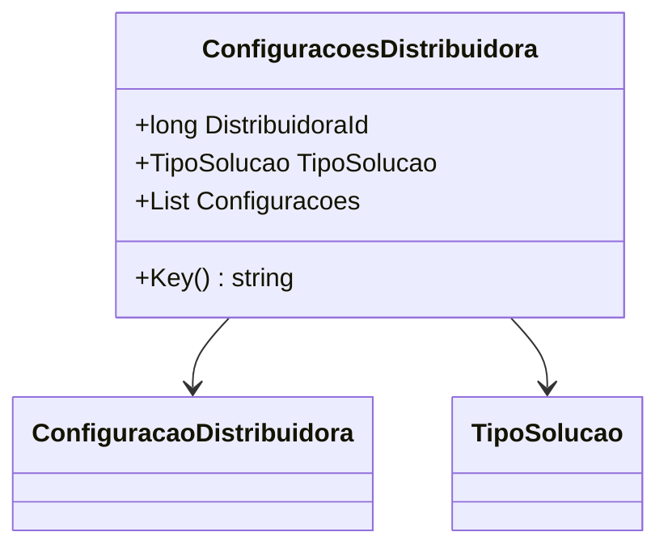

# ConfiguracoesDistribuidora
**Namespace**: IsthmusWinthor.Dominio.POCO  
**Nome do Arquivo**: ConfiguracoesDistribuidora.cs  

## Visão Geral e Responsabilidade
A classe `ConfiguracoesDistribuidora` representa a configuração de uma distribuidora no sistema. É responsável por encapsular as diferentes configurações associadas à distribuidora, utilizando um identificador único (`DistribuidoraId`) e um tipo de solução (`TipoSolucao`). Essa classe facilita a obtenção e o gerenciamento das configurações das distribuidoras, assegurando que as informações sejam organizadas e acessíveis de maneira eficiente.

## Métodos de Negócio

### Título: Key() - Visibilidade: Público
- **Objetivo**: Gera uma chave única para o cache de configurações da distribuidora, utilizando o identificador da distribuidora e o tipo de solução.
- **Comportamento**: 
  1. Invoca o método `DaConfiguracao` da classe `RedisKeys`, passando `DistribuidoraId` e `TipoSolucao`.
  2. O método retorna uma string que representa a chave de cache correspondente a essa configuração.
- **Retorno**: Retorna uma string que representa a chave única para o cache das configurações.

## Propriedades Calculadas e de Validação
- Não há propriedades com lógica no `get` ou validação no `set` nesta classe.

## Navigations Property
- `List<ConfiguracaoDistribuidora>`: Representa uma coleção de configurações específicas associadas à distribuidora, facilitando a gestão das configurações em um único objeto.
  - [ConfiguracaoDistribuidora](ConfiguracaoDistribuidora.md)

## Tipos Auxiliares e Dependências
- `TipoSolucao`: [TipoSolucao](TipoSolucao.md)
- `RedisKeys`: Classe estática que fornece métodos para a manipulação de chaves de cache.

## Diagrama de Relacionamentos

