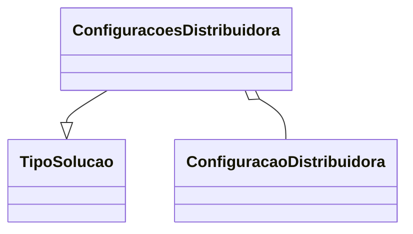

# ConfiguracoesDistribuidora
**Namespace**: IsthmusWinthor.Dominio.POCO  
**Nome do Arquivo**: ConfiguracoesDistribuidora.cs  

## Visão Geral e Responsabilidade
A classe `ConfiguracoesDistribuidora` é responsável por agrupar e gerenciar as configurações específicas de cada distribuidora dentro do sistema. Ela permite que as soluções oferecidas sejam configuradas de acordo com as necessidades de cada distribuidora, facilitando a personalização da oferta de serviços. Essa classe atua como um objeto de domínio, assegurando que cada distribuidora tenha as configurações corretas, permitindo que o sistema funcione de maneira coerente com as regras de negócio estabelecidas para cada tipo de solução.

## Métodos de Negócio
### Título: Key() - Visibilidade: Public
- **Objetivo**: Garante a geração de uma chave única para armazenar as configurações da distribuidora em cache.
- **Comportamento**: 
    1. Recebe o `DistribuidoraId` e o `TipoSolucao`.
    2. Chama o método estático `RedisKeys.DaConfiguracao`, passando os parâmetros do ID da distribuidora e o tipo da solução.
    3. Retorna a chave gerada que pode ser usada no armazenamento em cache.
- **Retorno**: Retorna uma string que representa a chave única para as configurações de uma distribuidora specificada.

## Propriedades Calculadas e de Validação
- Não há propriedades com lógica no `get` ou validação no `set`.

## Navigations Property
- `Configuracoes`: Propriedade que contém uma lista de configurações específicas da distribuidora. Representa uma coleção de objetos do tipo [ConfiguracaoDistribuidora](ConfiguracaoDistribuidora.md).

## Tipos Auxiliares e Dependências
- `TipoSolucao`: [TipoSolucao](TipoSolucao.md) - Enumerador que indica o tipo de solução oferecida pela distribuidora.
- `RedisKeys`: Classe auxiliar/estática utilizada para geração de chaves de armazenamento em cache.

## Diagrama de Relacionamentos

---
Gerada em 29/12/2025 21:30:42
