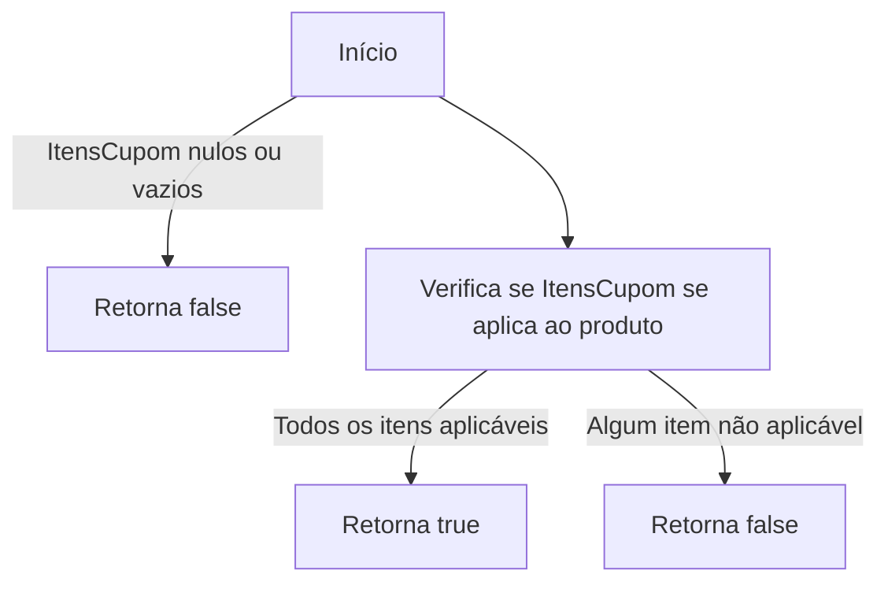
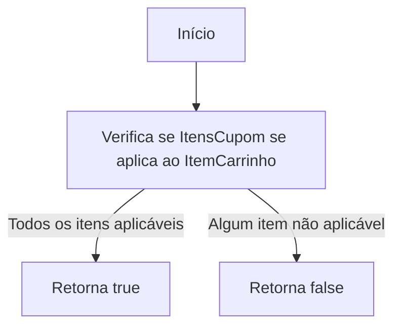
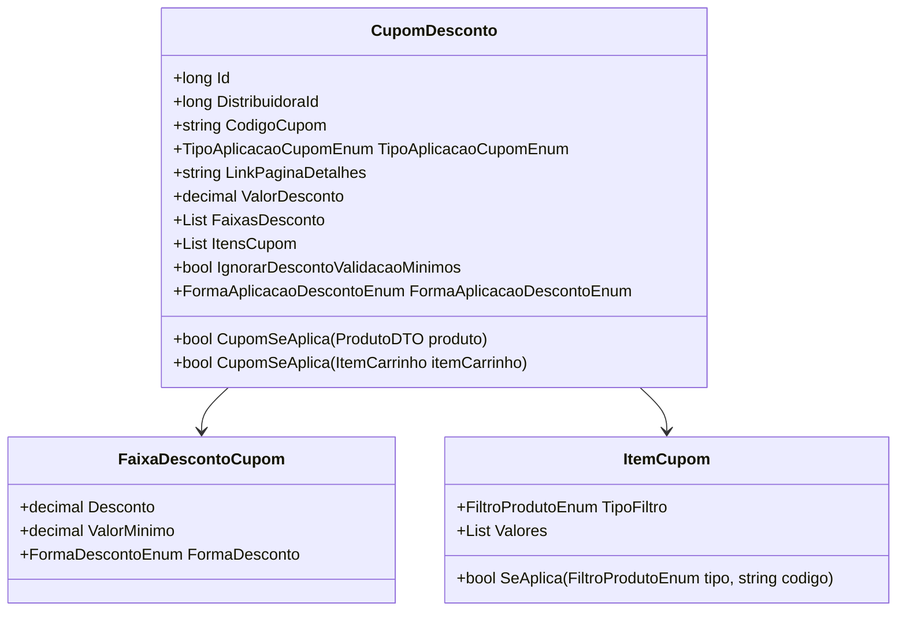

# CupomDesconto
**Namespace**: IsthmusWinthor.Dominio.POCO  
**Nome do Arquivo**: CupomDesconto.cs

## Visão Geral e Responsabilidade
A classe `CupomDesconto` representa um cupom que pode ser utilizado em um sistema de e-commerce para aplicar descontos em produtos ou itens de carrinho. Ela é responsável por determinar se um cupom de desconto é aplicável a um dado produto ou item de carrinho, com base em uma série de critérios definidos através de faixas de desconto e filtros associados. A classe ajuda a garantir que os descontos sejam aplicados de maneira correta e consistente, levando em conta as especificidades dos produtos elegíveis.

## Métodos de Negócio

### Título: CupomSeAplica(ProdutoDTO produto) - Público
- **Objetivo**: Verificar se o cupom se aplica a um determinado produto.
- **Comportamento**: 
  1. Verifica se a lista de itens do cupom está vazia ou nula, retornando `false` se este for o caso.
  2. Para cada item na lista de `ItensCupom`, verifica se ele se aplica ao produto utilizando uma série de filtros (Produto, Marca, Departamento, Categoria, Subcategoria e Fornecedor).
  3. Retorna `true` se todos os itens do cupom se aplicam ao produto, caso contrário, retorna `false`.

### Título: CupomSeAplica(ItemCarrinho itemCarrinho) - Público
- **Objetivo**: Verificar se o cupom se aplica a um determinado item no carrinho.
- **Comportamento**: 
  1. Avalia todos os itens presentes em `ItensCupom` com base nos filtros correspondentes ao `itemCarrinho`.
  2. A lógica é semelhante à do método anterior, onde cada item é examinado em relação ao código do produto, marca, departamento, categoria, subcategoria e fornecedor.
  3. Retorna `true` se todos os itens do cupom se aplicam ao item do carrinho, senão, retorna `false`.

## Propriedades Calculadas e de Validação
Não há propriedades com lógica no `get` ou validação no `set`.

## Navigations Property
- `FaixasDesconto`: [FaixaDescontoCupom](FaixaDescontoCupom.md)
- `ItensCupom`: [ItemCupom](ItemCupom.md)

## Tipos Auxiliares e Dependências
- Enumeradores:
  - [FiltroProdutoEnum](FiltroProdutoEnum.md)
  - [TipoAplicacaoCupomEnum](TipoAplicacaoCupomEnum.md)
  - [FormaAplicacaoDescontoEnum](FormaAplicacaoDescontoEnum.md)
  - [FormaDescontoEnum](FormaDescontoEnum.md)

## Diagrama de Relacionamentos

---
Gerada em 29/12/2025 21:31:11
