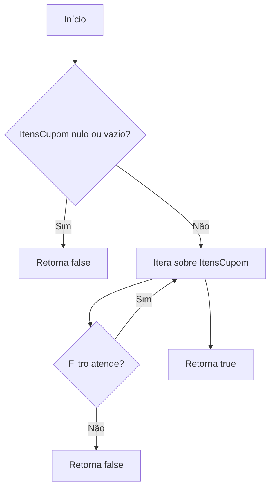
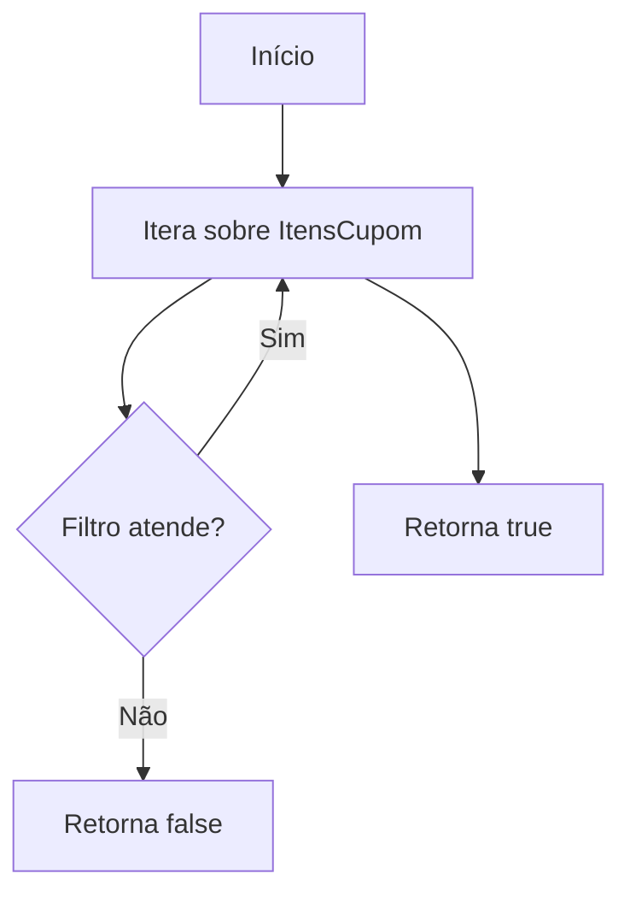
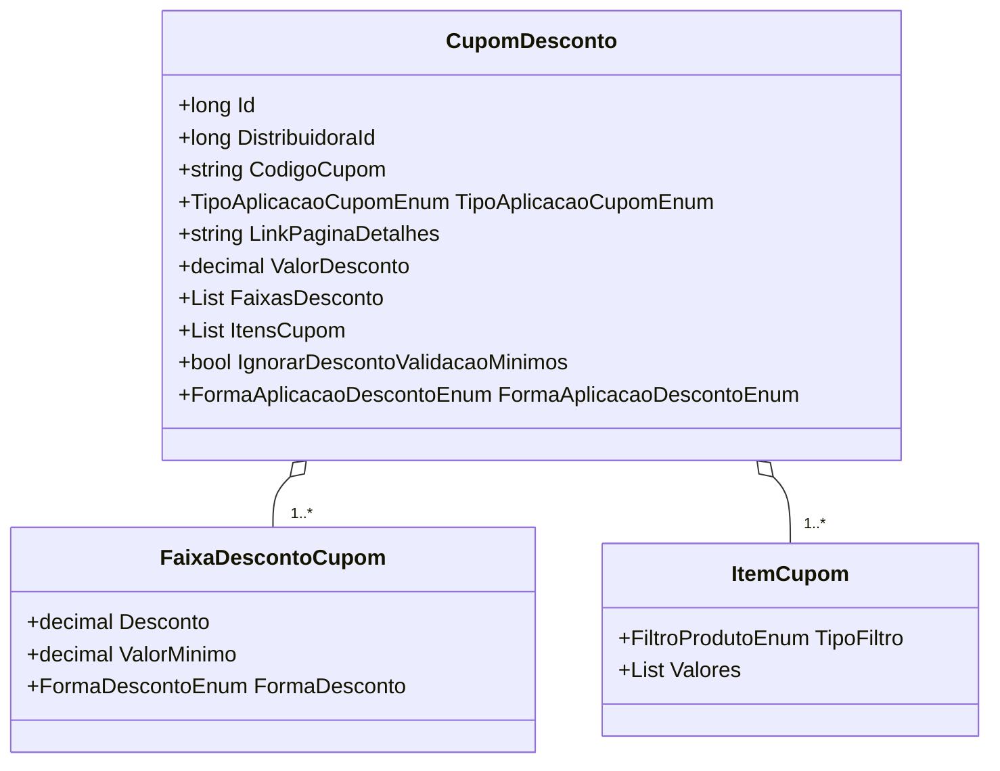

# CupomDesconto
- **Namespace**: IsthmusWinthor.Dominio.POCO
- **Nome do Arquivo**: CupomDesconto.cs

## Visão Geral e Responsabilidade
A classe `CupomDesconto` representa um cupom de desconto que pode ser aplicado a produtos e itens em um carrinho de compras. O papel desta classe é determinar se um determinado produto ou item atende aos critérios para a aplicação do desconto configurado, com base em um conjunto de regras de negócio definidas pelas faixas de desconto e as condições especificadas nos itens do cupom. Isso permite a promoção de vendas e ofertas específicas para determinados produtos, marcas ou categorias.

## Métodos de Negócio

### Título: CupomSeAplica(ProdutoDTO) - `public`
- **Objetivo**: Garante que o cupom se aplica ao produto, verificando se o produto atende a todas as condições listadas nos itens do cupom.
- **Comportamento**: 
  1. Verifica se a lista de `ItensCupom` é nula ou vazia. Se sim, retorna `false`.
  2. Para cada item no `ItensCupom`, realiza as validações necessárias:
     - Compara o código do produto com o filtro de produto.
     - Compara a marca do produto com o filtro de marca.
     - Compara o código do departamento, categoria, subcategoria e fornecedor do produto com os respectivos filtros.
  3. Retorna `true` se todos os filtros forem atendidos por pelo menos um dos itens; caso contrário, retorna `false`.
- **Retorno**: Retorna um `bool` indicando se o cupom se aplica ao produto.

### Título: CupomSeAplica(ItemCarrinho) - `public`
- **Objetivo**: Garante que o cupom se aplica ao item presente no carrinho, verificando se o item atende a todas as condições listadas nos itens do cupom.
- **Comportamento**: 
  1. Para cada item no `ItensCupom`, realiza as validações necessárias:
     - Compara o código do produto no item do carrinho com o filtro de produto.
     - Compara a marca, departamento, categoria e subcategoria do item do carrinho com os respectivos filtros.
  2. Retorna `true` se todos os filtros forem atendidos por pelo menos um dos itens; caso contrário, retorna `false`.
- **Retorno**: Retorna um `bool` indicando se o cupom se aplica ao item do carrinho.

## Propriedades Calculadas e de Validação
- **ValorDesconto**: Esta propriedade armazena o valor do desconto aplicado pelo cupom. O desconto pode ser influenciado pelas faixas de desconto, uma vez que condições adicionais podem ser aplicadas dependendo do valor mínimo de compra ou outras regras de negócio que devem ser definidas em outros métodos.

## Navigations Property
- **FaixasDesconto**: `[FaixaDescontoCupom](FaixaDescontoCupom.md)` - Representa as diversas faixas de desconto que podem ser aplicadas dependendo das condições do carrinho.
- **ItensCupom**: `[ItemCupom](ItemCupom.md)` - Lista dos itens que definem as regras de aplicação do cupom.

## Tipos Auxiliares e Dependências
- **Enums**:
  - `[TipoAplicacaoCupomEnum](TipoAplicacaoCupomEnum.md)` - Enum que representa os diferentes tipos de aplicação do cupom.
  - `[FormaAplicacaoDescontoEnum](FormaAplicacaoDescontoEnum.md)` - Enum representando como o desconto deve ser aplicado.
  - `[FiltroProdutoEnum](FiltroProdutoEnum.md)` - Enum que lista os possíveis filtros que podem ser utilizados para a aplicação do cupom.
  - `[FormaDescontoEnum](FormaDescontoEnum.md)` - Enum que define como o desconto é calculado.

## Diagrama de Relacionamentos

