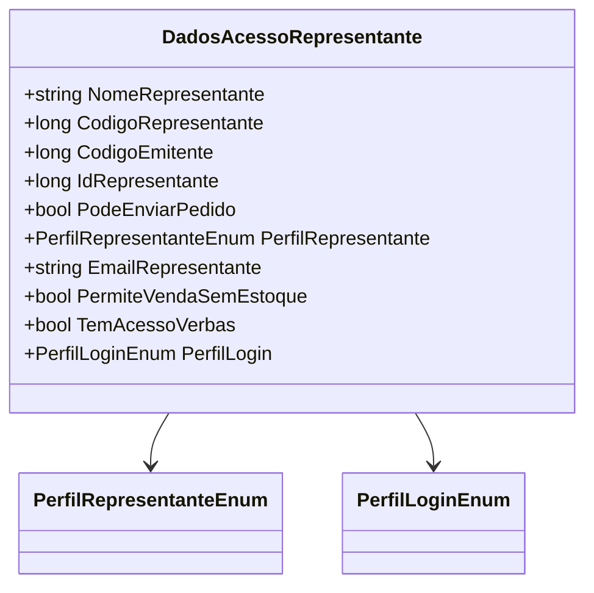

# DadosAcessoRepresentante
**Namespace**: IsthmusWinthor.Dominio.POCO  
**Nome do Arquivo**: DadosAcessoRepresentante.cs  

## Visão Geral e Responsabilidade
A classe `DadosAcessoRepresentante` é um modelo representativo que encapsula as informações de acesso e permissões associadas a diferentes tipos de representantes (Vendedor, Supervisor, Gerente). Sua principal responsabilidade é fornecer a estrutura de dados que determina o que um representante pode fazer dentro do sistema de vendas, assegurando que somente as operações permitidas sejam realizadas em função do perfil do usuário.

## Métodos de Negócio

### Título: PerfilLogin (public)
- **Objetivo**: Garante que o tipo de perfil de acesso do representante seja corretamente traduzido para um perfil de login correspondente, assegurando que o acesso ao sistema seja restrito de acordo com as permissões relevantes.
- **Comportamento**: 
    1. A propriedade avalia o `PerfilRepresentante`.
    2. Se o perfil for `Vendedor`, retorna `PerfilLoginEnum.Vendedor`.
    3. Se for `Supervisor`, retorna `PerfilLoginEnum.Supervisor`.
    4. Se for `Gerente`, retorna `PerfilLoginEnum.Gerente`.
    5. Para qualquer outro caso, assume o padrão como `PerfilLoginEnum.Vendedor`.
- **Retorno**: Retorna o valor do tipo `PerfilLoginEnum` que especifica o nível de acesso do representante no sistema.

### Título: Implicit Operator (várias, `public static`)
- **Objetivo**: Facilita a conversão implícita de diferentes entidades de representantes (Vendedor, Supervisor, Gerente) para a classe `DadosAcessoRepresentante`, permitindo a manipulação simplificada de dados entre diferentes camadas do sistema.
- **Comportamento**:
    1. Recebe uma instância de `Entidades.Vendedor`, `Entidades.Supervisor` ou `Entidades.Gerente`.
    2. Extrai propriedades relevantes de cada entidade e cria uma nova instância de `DadosAcessoRepresentante`.
    3. Define o `PerfilRepresentante` com base no tipo de representante, além de configurar outras permissões específicas.
- **Retorno**: Nenhum retorno explícito, pois é uma operação de conversão implícita.

## Propriedades Calculadas e de Validação
### PerfilLogin
- **Regra**: A propriedade `PerfilLogin` calcula seu valor com base no `PerfilRepresentante` para assegurar que o tipo de login esteja correto para o representante, ajustando automaticamente o acesso conforme necessário.

## Navigations Property
- Nenhuma propriedade de navegação complexa está presente nesta classe.

## Tipos Auxiliares e Dependências
- Enum `[PerfilRepresentanteEnum](PerfilRepresentanteEnum.md)`
- Enum `[PerfilLoginEnum](PerfilLoginEnum.md)`

## Diagrama de Relacionamentos

