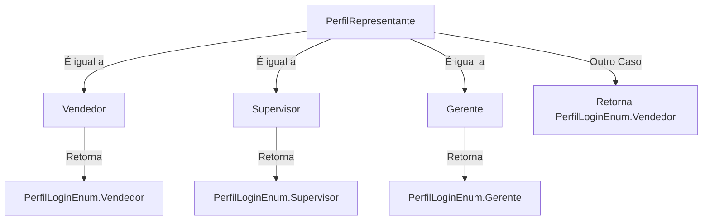
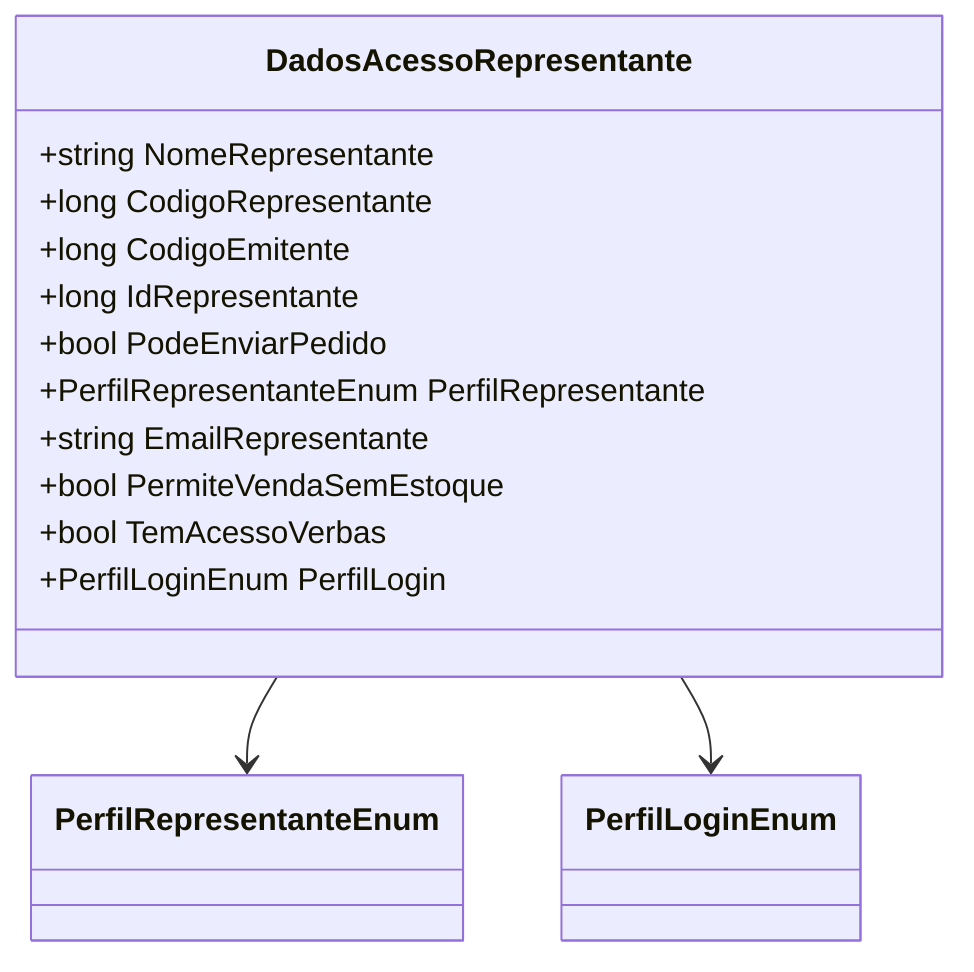

# DadosAcessoRepresentante
**Namespace**: IsthmusWinthor.Dominio.POCO  
**Nome do Arquivo**: DadosAcessoRepresentante.cs  

## Visão Geral e Responsabilidade
A classe `DadosAcessoRepresentante` encapsula as informações de acesso e autenticação de representantes dentro de um sistema corporativo. Ela é responsável por gerenciar e fornecer dados relevantes sobre os diferentes tipos de representantes (Vendedor, Supervisor e Gerente) e suas permissões associadas para operações como envio de pedidos e acesso a verbas. 

## Métodos de Negócio

### Título: `PerfilLogin` (propriedade)

- **Objetivo**: Determina o perfil de login com base no perfil do representante, essencial para controle de permissões no sistema.
- **Comportamento**:
  1. Avalia o `PerfilRepresentante`.
  2. Retorna `PerfilLoginEnum.Vendedor` se `PerfilRepresentante` for `Vendedor`.
  3. Retorna `PerfilLoginEnum.Supervisor` se `PerfilRepresentante` for `Supervisor`.
  4. Retorna `PerfilLoginEnum.Gerente` se `PerfilRepresentante` for `Gerente`.
  5. Retorna `PerfilLoginEnum.Vendedor` por padrão, caso ocorra um valor não esperado.
- **Retorno**: O valor retornado é de tipo `PerfilLoginEnum`, refletindo o perfil associado ao representante.

## Propriedades Calculadas e de Validação

### `PerfilLogin`
- **Regra**: O valor do `PerfilLogin` é calculado com base no `PerfilRepresentante`. A lógica garante que cada tipo de representante tenha um nível apropriado de acesso dentro do sistema, assegurando uma validação de permissões que se encaixa em suas funções específicas.

## Navigations Property
- Não há propriedades complexas de navegação associadas a esta classe.

## Tipos Auxiliares e Dependências
- Dependências do tipo `Enum`:
  - [PerfilRepresentanteEnum](PerfilRepresentanteEnum.md)
  - [PerfilLoginEnum](PerfilLoginEnum.md)

## Diagrama de Relacionamentos

---
Gerada em 29/12/2025 21:31:29
