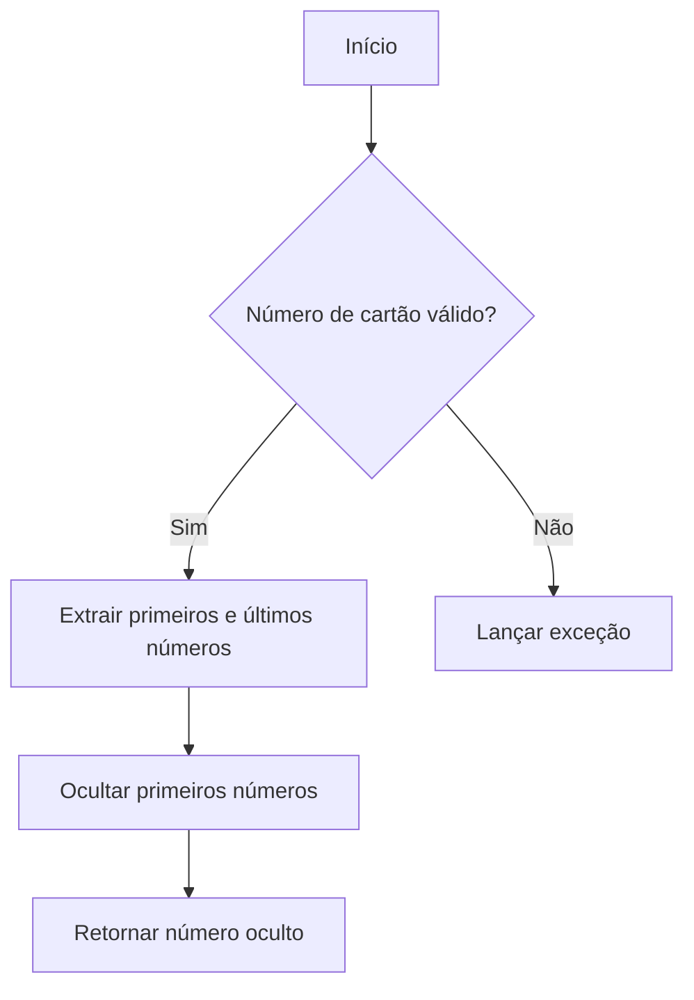
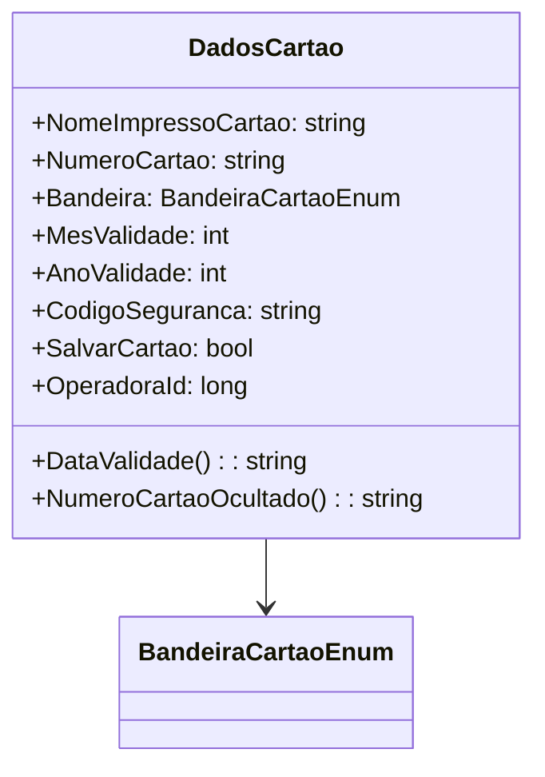

# DadosCartao
**Namespace**: IsthmusWinthor.Dominio.POCO  
**Nome do Arquivo**: DadosCartao.cs  

## Visão Geral e Responsabilidade
A classe `DadosCartao` atua como uma representação de informações sensíveis relacionadas a cartões de crédito ou débito. Ela é responsável por manipular os dados essenciais de um cartão, garantindo que informações como validade e número de cartão sejam processadas corretamente. Essa classe resolve problemas de negócio relacionados à segurança e à formatação de dados vinculados ao uso de cartões.

## Métodos de Negócio

### Título: `NumeroCartaoOcultado` - Visibilidade: `public`
- **Objetivo**: Garante que o número do cartão seja ocultado, exceto pelos últimos quatro dígitos, permitindo a visualização segura das informações.
- **Comportamento**:
  1. Verifica se o comprimento do `NumeroCartao` é menor que 4.
  2. Caso seja, lança uma exceção informando que o número do cartão é inválido.
  3. Extrai os primeiros dígitos, exceto os últimos quatro, do `NumeroCartao`.
  4. Substitui os números dos primeiros dígitos por 'x', mantendo os últimos quatro inalterados.
  5. Retorna o número do cartão oculto como uma string.
- **Retorno**: Uma string representando o número do cartão onde os primeiros dígitos estão ocultos por 'x' e somente os últimos quatro dígitos são visíveis.

### Título: `DataValidade` - Visibilidade: `public`
- **Objetivo**: Formata a data de validade do cartão em um padrão padrão "MM/AAAA".
- **Comportamento**:
  1. Usa os valores das propriedades `MesValidade` e `AnoValidade` para criar uma string formatada no formato desejado.
  2. Retorna a string resultante.
- **Retorno**: Uma string representando a data de validade do cartão no formato "MM/AAAA".

## Propriedades Calculadas e de Validação
### Propriedades
- `DataValidade`: Calcula a data de validade do cartão com base no mês e no ano fornecidos.

## Navigations Property
- Nenhuma propriedade de navegação complexa listada nesta classe.

## Tipos Auxiliares e Dependências
- **Enumeradores**:  
  - [BandeiraCartaoEnum](BandeiraCartaoEnum.md)

## Diagrama de Relacionamentos

---
Gerada em 29/12/2025 21:31:46
