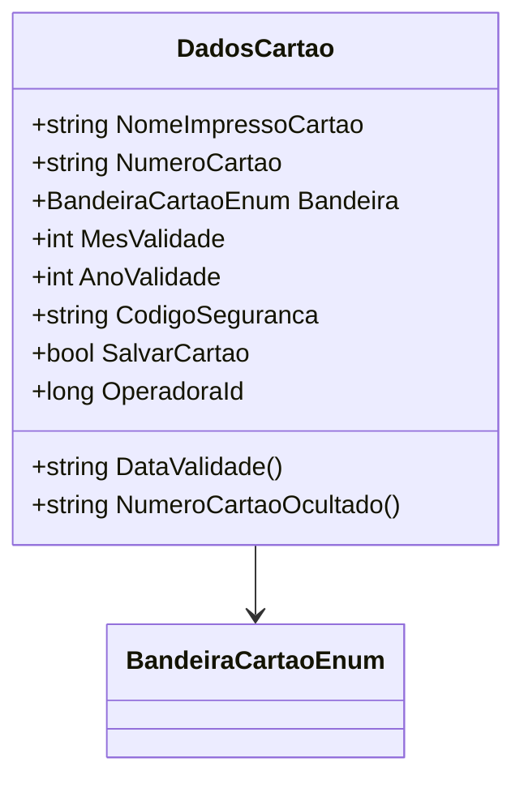

# DadosCartao
**Namespace**: IsthmusWinthor.Dominio.POCO  
**Nome do Arquivo**: DadosCartao.cs  

## Visão Geral e Responsabilidade
A classe `DadosCartao` representa os dados essenciais de um cartão de pagamento, incluindo informações como o nome impresso, número do cartão, bandeira do cartão, validade e código de segurança. A principal responsabilidade dessa classe consiste na validação e manipulação de dados sensíveis relacionados aos cartões, assegurando que as informações sejam apresentadas de forma segura, por exemplo, ocultando parte do número do cartão.

## Métodos de Negócio

### Título: NumeroCartaoOcultado() - Public
- **Objetivo**: Garantir a segurança do número do cartão ao apresentá-lo ao usuário, ocultando os primeiros dígitos.
- **Comportamento**:
    1. Verifica se o comprimento do `NumeroCartao` é menor que 4. Se sim, lança uma exceção, pois o número do cartão é considerado inválido.
    2. Se o número for válido, separa os primeiros números (todos menos os quatro últimos) e os últimos quatro dígitos.
    3. Os primeiros números são convertidos para 'x' se forem dígitos, mantendo outros caracteres intactos.
    4. Concatena os dígitos exibidos como 'x' com os últimos quatro números do cartão.
- **Retorno**: Retorna uma string que representa o número do cartão, com os primeiros dígitos ocultos.

```mermaid
flowchart TD
    A[Início] --> B{Número de Cartão Válido?}
    B -- Sim --> C[Separar os primeiros números e os últimos 4]
    B -- Não --> D[Lançar exceção "Número de cartão inválido!"]
    C --> E[Substituir dígitos por 'x']
    E --> F[Retornar combinação dos primeiros números e últimos 4]
```

### Título: DataValidade() - Public
- **Objetivo**: Fornecer a data de validade do cartão em um formato padronizado.
- **Comportamento**: Formata o mês e o ano de validade em uma string no formato "MM/AAAA", garantindo que o mês seja sempre exibido com dois dígitos.
- **Retorno**: Retorna uma string representando a data de validade do cartão.

## Propriedades Calculadas e de Validação
- **DataValidade**: A propriedade `DataValidade()` é uma forma calculada que garante a formatação correta da data de validade do cartão.

## Navigations Property
- Nenhuma.

## Tipos Auxiliares e Dependências
- [BandeiraCartaoEnum](BandeiraCartaoEnum.md)

## Diagrama de Relacionamentos

