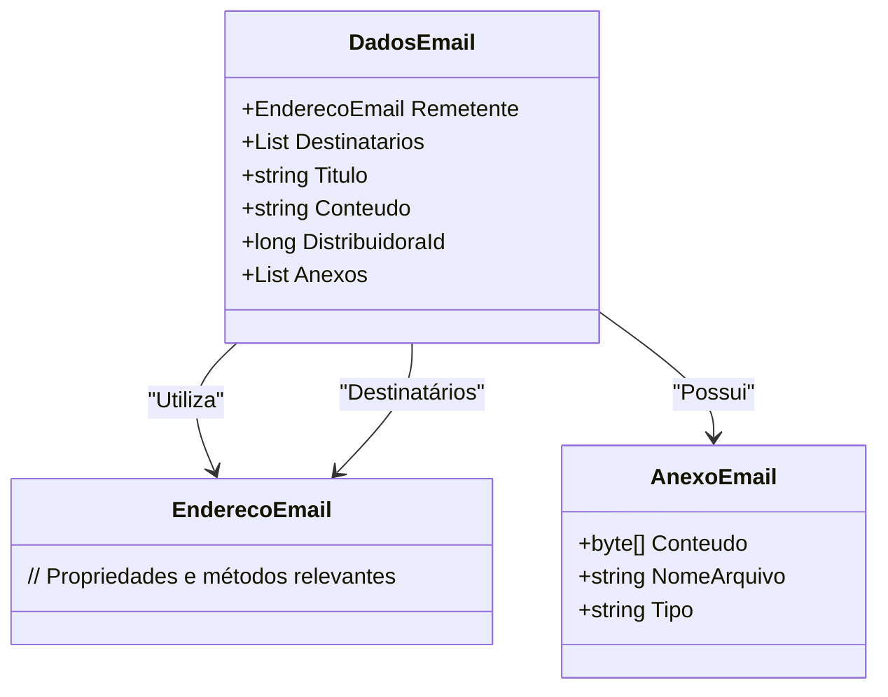

# DadosEmail

**Namespace**: IsthmusWinthor.Dominio.POCO  
**Nome do Arquivo**: DadosEmail.cs

## Visão Geral e Responsabilidade
A classe `DadosEmail` é responsável por encapsular as informações necessárias para a composição de um email dentro do sistema. Isso inclui detalhes sobre o remetente, destinatários, o título e o conteúdo da mensagem, além de anexos. Essa estrutura permite uma representação clara e organizada dos dados que compõem a comunicação por email, tratando a lógica necessária para garantir que todos os dados essenciais sejam fornecidos antes do envio.

## Métodos de Negócio
A classe `DadosEmail` não contém métodos de negócio com lógica complexa que exijam uma descrição detalhada.

## Propriedades Calculadas e de Validação
Não há propriedades com lógica de cálculo ou validação específica na classe `DadosEmail`.

## Navigations Property
- `EnderecoEmail Remetente` - [EnderecoEmail](EnderecoEmail.md)  
- `List<EnderecoEmail> Destinatarios` - [EnderecoEmail](EnderecoEmail.md)  
- `List<AnexoEmail> Anexos` - [AnexoEmail](AnexoEmail.md)  

## Tipos Auxiliares e Dependências
- `EnderecoEmail` - [EnderecoEmail](EnderecoEmail.md)  
- `AnexoEmail` - [AnexoEmail](AnexoEmail.md)  

## Diagrama de Relacionamentos

---
Gerada em 29/12/2025 21:31:59
