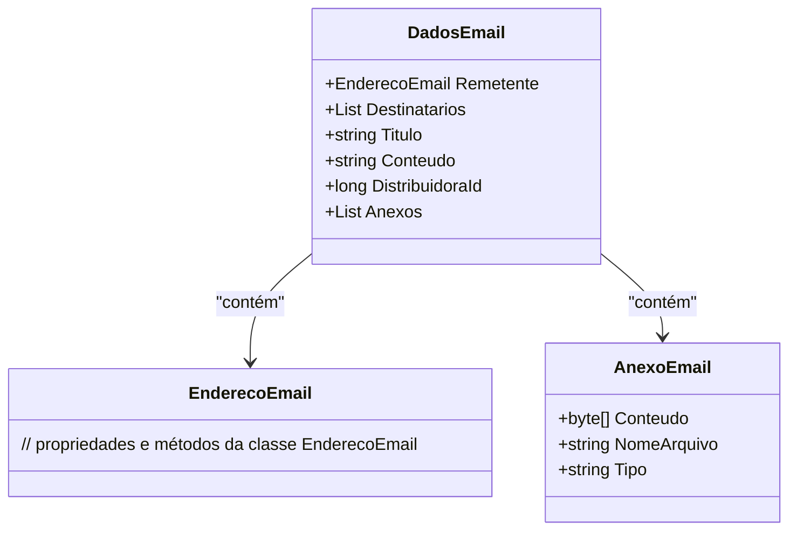

# DadosEmail

**Namespace**: IsthmusWinthor.Dominio.POCO  
**Nome do Arquivo**: DadosEmail.cs

## Visão Geral e Responsabilidade
A classe `DadosEmail` representa um modelo de dados relacionado ao envio de emails dentro do sistema. Ela é responsável por encapsular as informações necessárias para compor e enviar um email, incluindo o remetente, destinatários, assunto, conteúdo e anexos. O problema de negócio que a classe resolve é a estruturação e validação dos dados necessários para garantir que um email possa ser enviado corretamente, mantendo a integridade e a formatação adequada das informações.

## Métodos de Negócio
(Observação: A classe não possui métodos com lógica condicional significativa.)

## Propriedades Calculadas e de Validação
(Observação: A classe não possui propriedades com lógica no `get` ou validação no `set`.)

## Navigations Property
- `EnderecoEmail Remetente`: Representa o remetente do email. Presume-se que a classe `EnderecoEmail` exista e contenha lógica para validação de endereços de email. 
  - [EnderecoEmail](EnderecoEmail.md)
- `List<EnderecoEmail> Destinatarios`: Representa os destinatários do email, que são múltiplos. Esta propriedade deve garantir que ao menos um destinatário válido esteja presente.
- `List<AnexoEmail> Anexos`: Representa os anexos do email, onde cada anexo deve ser validado quanto ao seu formato e tamanho.
  - [AnexoEmail](AnexoEmail.md)

## Tipos Auxiliares e Dependências
- `EnderecoEmail`: Necessário para definir as propriedades relacionadas ao remetente e destinatários.
  - [EnderecoEmail](EnderecoEmail.md)
- `AnexoEmail`: Necessário para descrever as propriedades relacionadas aos anexos do email.
  - [AnexoEmail](AnexoEmail.md)

## Diagrama de Relacionamentos

