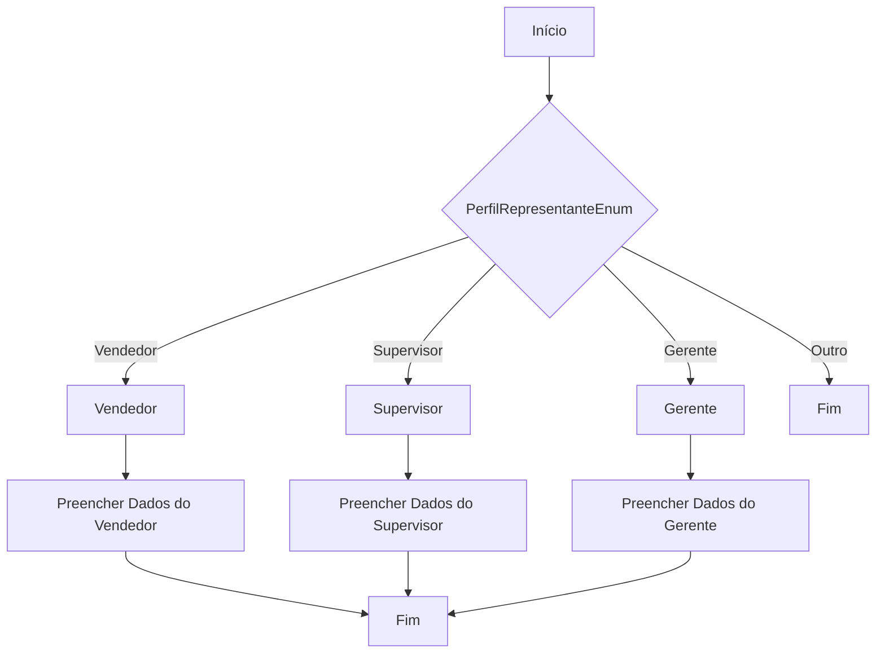
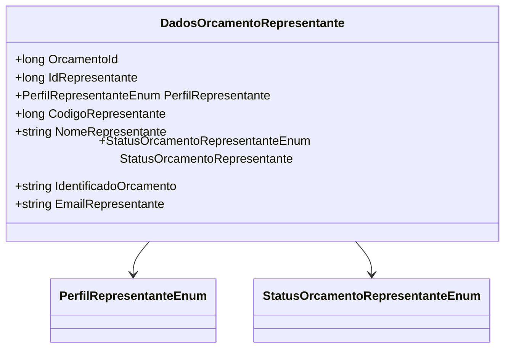

# DadosOrcamentoRepresentante
**Namespace**: IsthmusWinthor.Dominio.POCO  
**Nome do Arquivo**: DadosOrcamentoRepresentante.cs  

## Visão Geral e Responsabilidade
A classe `DadosOrcamentoRepresentante` representa as informações essenciais do representante de vendas associadas a um orçamento. Seu objetivo é consolidar e transportar dados relacionados ao representante, incluindo seu perfil, identificação e status, para que possam ser utilizados em processos de negócios subsequentes, como relatórios ou validações de status.

## Métodos de Negócio

### Título: DadosOrcamentoRepresentante (Construtor)  
**Objetivo**: Inicializa uma nova instância da classe `DadosOrcamentoRepresentante`, extraindo as informações do `Orcamento` fornecido.  
**Comportamento**: 
1. Recebe um objeto `Orcamento` como parâmetro.
2. Copia o valor do status do orçamento representado e o identificador do orçamento.
3. Avalia o `PerfilRepresentanteEnum` do representante e preenche as informações referente ao representante (código, id, email e nome) conforme o perfil (Vendedor, Supervisor ou Gerente).
4. Se o perfil não for reconhecido, os valores são mantidos em seus estados padrão (nulos ou zero).
**Retorno**: A classe não retorna, mas a instância criada possui as propriedades preenchidas com valores extraídos do objeto `Orcamento`.

### Visualização:

## Propriedades Calculadas e de Validação
Não há propriedades com cálculos ou validações específicas, uma vez que todas têm um procedimento de inicialização direto.

## Navigations Property
- Nenhuma navigation property complexa é identificada nessa classe.

## Tipos Auxiliares e Dependências
- Enumeradores utilizados:
  - `[PerfilRepresentanteEnum](PerfilRepresentanteEnum.md)`
  - `[StatusOrcamentoRepresentanteEnum](StatusOrcamentoRepresentanteEnum.md)`

## Diagrama de Relacionamentos

