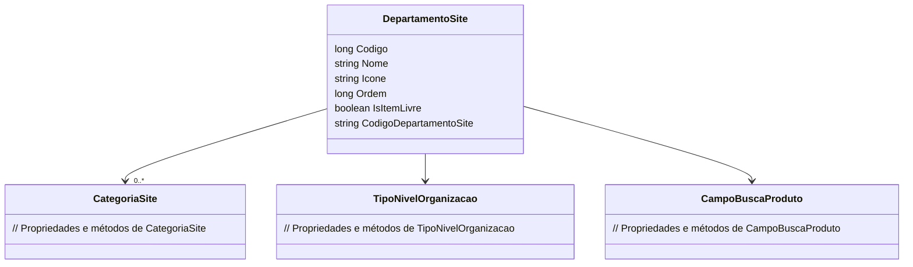

# DepartamentoSite
**Namespace**: IsthmusWinthor.Dominio.POCO  
**Nome do Arquivo**: DepartamentoSite.cs  

A classe `DepartamentoSite` é responsável por representar os departamentos dentro de um sistema de gerenciamento de site. Cada departamento possui propriedades que definem sua estrutura, visualização e organização, facilitando a categorização de produtos e informações relevantes no site. Esta classe é essencial para garantir a correta organização e funcionalidade do e-commerce, fornecendo uma estrutura hierárquica que reflete a lógica de negócios da organização.

## Métodos de Negócio
A classe `DepartamentoSite` não implementa métodos de negócio que contenham lógica complexa ou validações. Ela atua principalmente como um objeto de transporte de dados.

## Propriedades Calculadas e de Validação
As propriedades da classe `DepartamentoSite` são anêmicas e não contêm lógica de negócio nos seus `get` ou `set`.

## Navigations Property
- `List<CategoriaSite> Categorias`: Representa uma lista de categorias associadas a este departamento.  
  [CategoriaSite](CategoriaSite.md)

## Tipos Auxiliares e Dependências
- `TipoNivelOrganizacao`: Enum que representa os diferentes níveis organizacionais que um departamento pode ter.  
  [TipoNivelOrganizacao](TipoNivelOrganizacao.md)
- `CampoBuscaProduto`: Enum que define os campos que podem ser utilizados para busca de produtos associados a um departamento.  
  [CampoBuscaProduto](CampoBuscaProduto.md)

## Diagrama de Relacionamentos

