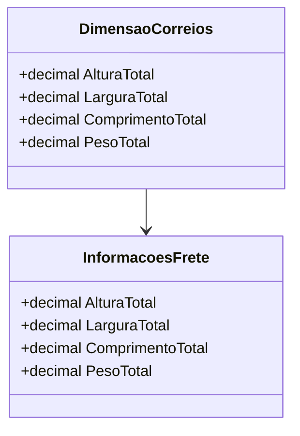

# DimensaoCorreios
**Namespace**: IsthmusWinthor.Dominio.POCO  
**Nome do Arquivo**: DimensaoCorreios.cs  

## Visão Geral e Responsabilidade
A classe `DimensaoCorreios` atua como um motor de validação para as dimensões e peso de um pacote conforme os requisitos estabelecidos pelos Correios. O problema de negócio que essa classe resolve é garantir que as dimensões de um pacote atendam aos limites mínimos exigidos para o envio, evitando assim erros e impedimentos na operação de frete.

## Métodos de Negócio

### Título: ValidarAltura (private)  
- **Objetivo**: Garante que a altura total do pacote não esteja abaixo do limite mínimo estabelecido.  
- **Comportamento**: 
  1. Verifica se a altura total informada é inferior a `AlturaMinima` (2 cm). 
  2. Se a altura for inferior, retorna `AlturaMinima`.
  3. Caso contrário, retorna a altura total informada.  
- **Retorno**: Retorna um valor decimal que representa a altura válida do pacote.

### Título: ValidarLargura (private)  
- **Objetivo**: Garante que a largura total do pacote não esteja abaixo do limite mínimo estabelecido.  
- **Comportamento**: 
  1. Verifica se a largura total informada é inferior a `LarguraMinima` (11 cm). 
  2. Se a largura for inferior, retorna `LarguraMinima`.
  3. Caso contrário, retorna a largura total informada.  
- **Retorno**: Retorna um valor decimal que representa a largura válida do pacote.

### Título: ValidarComprimento (private)  
- **Objetivo**: Garante que o comprimento total do pacote não esteja abaixo do limite mínimo estabelecido.  
- **Comportamento**: 
  1. Verifica se o comprimento total informado é inferior a `ComprimentoMinimo` (16 cm). 
  2. Se o comprimento for inferior, retorna `ComprimentoMinimo`.
  3. Caso contrário, retorna o comprimento total informado.  
- **Retorno**: Retorna um valor decimal que representa o comprimento válido do pacote.

### Título: ValidarPeso (private)  
- **Objetivo**: Fornece o peso total do pacote. Não aplica validações, pois o peso é considerado válido se passado corretamente.  
- **Comportamento**: Retorna o peso total informado através da referência `_informacoesFrete`.  
- **Retorno**: Retorna um valor decimal que representa o peso total do pacote.

## Propriedades Calculadas e de Validação
- `AlturaTotal`: Calcula a altura total do pacote com validação.
- `LarguraTotal`: Calcula a largura total do pacote com validação.
- `ComprimentoTotal`: Calcula o comprimento total do pacote com validação.
- `PesoTotal`: Retorna o peso total do pacote diretamente, sem validação.

## Navigations Property
- `[InformacoesFrete](InformacoesFrete.md)`: Representa as informações de frete que contêm os dados de altura, largura, comprimento e peso do pacote.

## Tipos Auxiliares e Dependências
- `[InformacoesFrete](InformacoesFrete.md)`

## Diagrama de Relacionamentos

