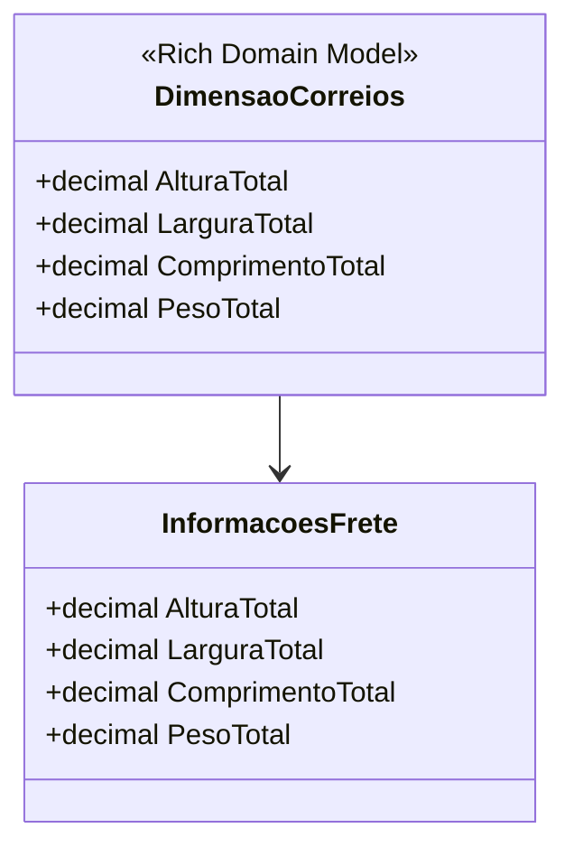

# DimensaoCorreios
- **Namespace**: IsthmusWinthor.Dominio.POCO
- **Nome do Arquivo**: DimensaoCorreios.cs

## Visão Geral e Responsabilidade
A classe `DimensaoCorreios` atua como um motor de validação para as dimensões e peso de uma encomenda com base nas regras estabelecidas pelos Correios. O problema de negócio que ela resolve é garantir que as dimensões mínimas definidas para o envio sejam atendidas, evitando rejeições de pacotes que não estão em conformidade.

## Métodos de Negócio

### `ValidarAltura` (private)
- **Objetivo**: Garante que a altura total de uma encomenda não seja inferior ao limite mínimo estipulado pelos Correios.
- **Comportamento**: 
  1. Compara a altura total fornecida com a altura mínima permitida.
  2. Se a altura total for inferior a `AlturaMinima`, retorna `AlturaMinima`.
  3. Caso contrário, retorna a altura total.
- **Retorno**: Retorna a altura total válida, que é garantida ser igual ou maior que a altura mínima.

### `ValidarLargura` (private)
- **Objetivo**: Garante que a largura total de uma encomenda não seja inferior ao limite mínimo estipulado pelos Correios.
- **Comportamento**: 
  1. Compara a largura total fornecida com a largura mínima permitida.
  2. Se a largura total for inferior a `LarguraMinima`, retorna `LarguraMinima`.
  3. Caso contrário, retorna a largura total.
- **Retorno**: Retorna a largura total válida, que é garantida ser igual ou maior que a largura mínima.

### `ValidarComprimento` (private)
- **Objetivo**: Garante que o comprimento total de uma encomenda não seja inferior ao limite mínimo estipulado pelos Correios.
- **Comportamento**: 
  1. Compara o comprimento total fornecido com o comprimento mínimo permitido.
  2. Se o comprimento total for inferior a `ComprimentoMinimo`, retorna `ComprimentoMinimo`.
  3. Caso contrário, retorna o comprimento total.
- **Retorno**: Retorna o comprimento total válido, que é garantido ser igual ou maior que o comprimento mínimo.

### `ValidarPeso` (private)
- **Objetivo**: Garante que o peso total de uma encomenda seja retornado de forma válida, sem intervenções de validação, assumindo que o peso já foi validado antes.
- **Comportamento**: Apenas retorna o peso total fornecido nas informações de frete.
- **Retorno**: Retorna o peso total, que pode ser utilizado em cálculos de frete e outras validações externas.

## Propriedades Calculadas e de Validação
- `AlturaTotal`: Calculada através do método `ValidarAltura`, assegurando que não seja menor que a altura mínima.
- `LarguraTotal`: Calculada através do método `ValidarLargura`, assegurando que não seja menor que a largura mínima.
- `ComprimentoTotal`: Calculada através do método `ValidarComprimento`, assegurando que não seja menor que o comprimento mínimo.
- `PesoTotal`: Validado através do método `ValidarPeso`, retornando diretamente o peso total.

## Navigations Property
- `InformacoesFrete`: [InformacoesFrete](InformacoesFrete.md) - Representa as informações de frete que contêm os dados de peso e dimensões da encomenda.

## Tipos Auxiliares e Dependências
- **Classes Utilizadas**: `InformacoesFrete` - Espera-se que esta classe forneça as propriedades de `AlturaTotal`, `LarguraTotal`, `ComprimentoTotal` e `PesoTotal`.

## Diagrama de Relacionamentos

---
Gerada em 29/12/2025 21:32:31
