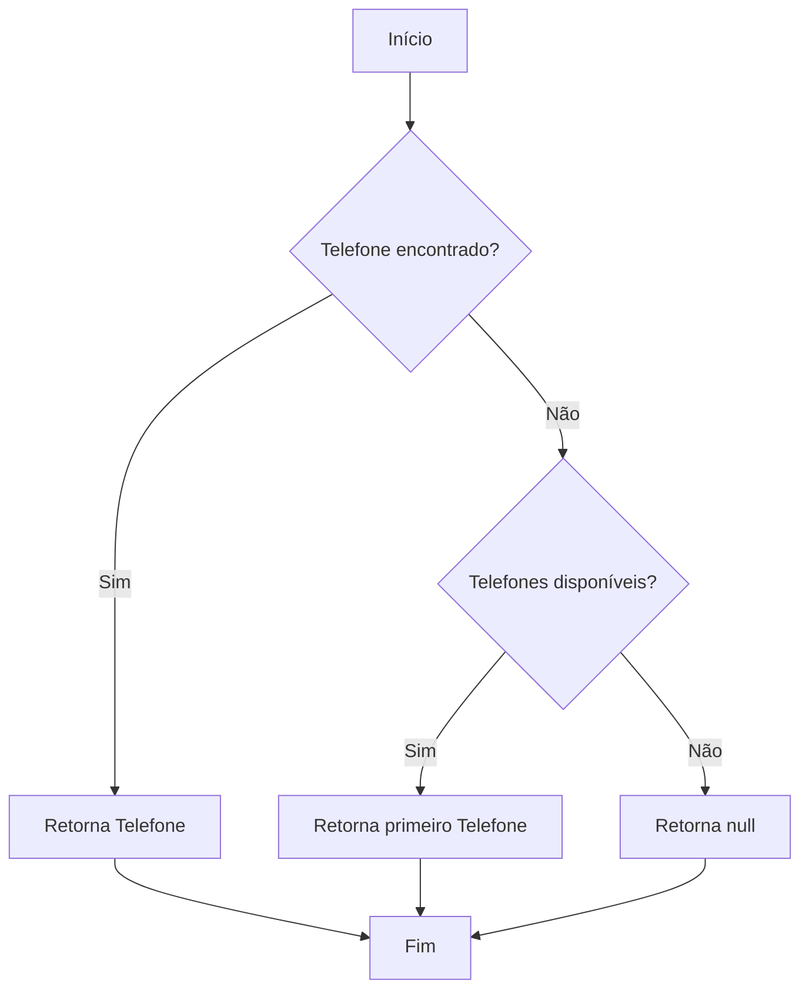
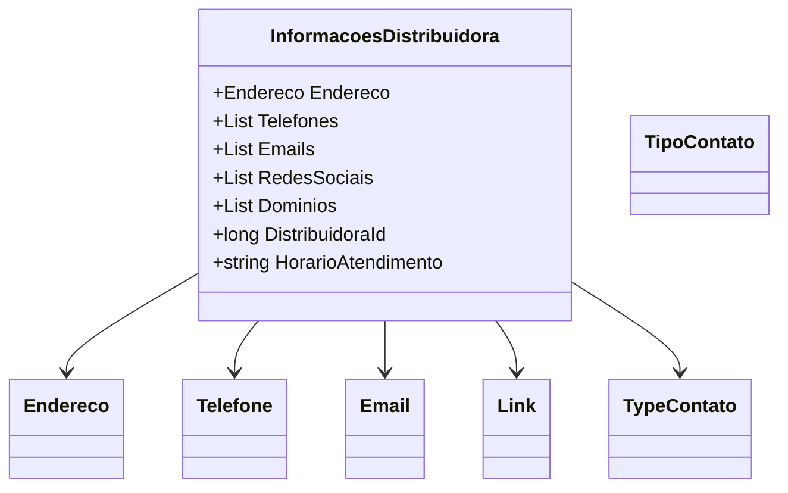

# InformacoesDistribuidora
**Namespace**: IsthmusWinthor.Dominio.POCO.Distribuidoras  
**Nome do Arquivo**: InformacoesDistribuidora.cs  

## Visão Geral e Responsabilidade
A classe `InformacoesDistribuidora` é responsável por encapsular todas as informações relevantes sobre uma distribuidora, incluindo dados de contato, endereço, logotipo e horários de atendimento. Assim, ela atende à necessidade de organizar e centralizar as informações essenciais para facilitar o acesso e a gestão dessas informações no contexto dos fluxos de trabalho da aplicação.

## Métodos de Negócio

### TelefoneTipo (public)
- **Objetivo**: Garante que seja possível recuperar um telefone específico de acordo com o tipo de contato solicitado (por exemplo, telefone para suporte, vendas etc.). Se não houver um telefone específico, retorna o primeiro número disponível.
- **Comportamento**: 
  1. O método aceita um parâmetro do tipo `TipoContato`.
  2. Utiliza LINQ para procurar um telefone na lista `Telefones` que corresponda ao tipo especificado.
  3. Se não encontrar um telefone do tipo solicitado, retorna o primeiro telefone disponível na lista ou `null`, se a lista estiver vazia.
- **Retorno**: Retorna uma instância da classe `Telefone` correspondente ao tipo de contato ou `null` se nenhum telefone estiver disponível.

## Propriedades Calculadas e de Validação
- Não há propriedades com lógica de cálculo em `get` ou validação em `set`.

## Navigations Property
- `Endereco`: [Endereco](Endereco.md)  
- `Telefones`: [Telefone](Telefone.md)  
- `Emails`: [Email](Email.md)  
- `RedesSociais`: [Link](Link.md)  
- `Dominios`: [Link](Link.md)  

## Tipos Auxiliares e Dependências
- `TipoContato`: [TipoContato](TipoContato.md)  
- Classes utilitárias: `Endereco`, `Telefone`, `Email`, `Link`

## Diagrama de Relacionamentos

---
Gerada em 29/12/2025 21:42:31
