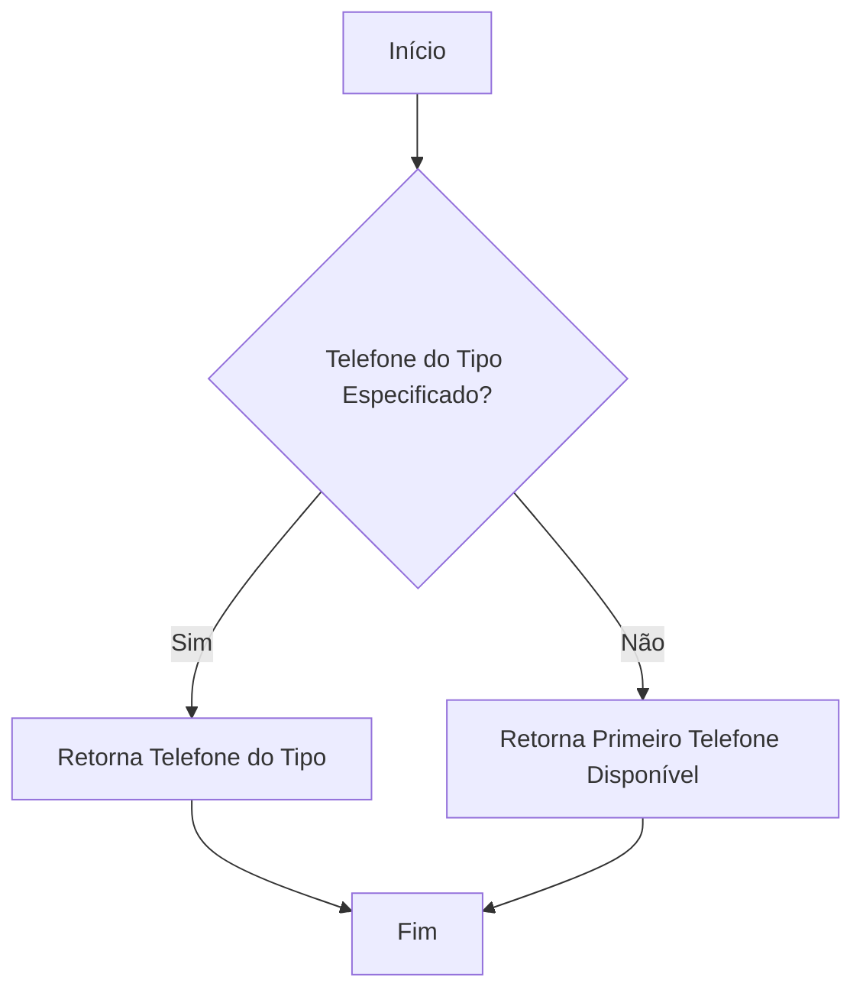
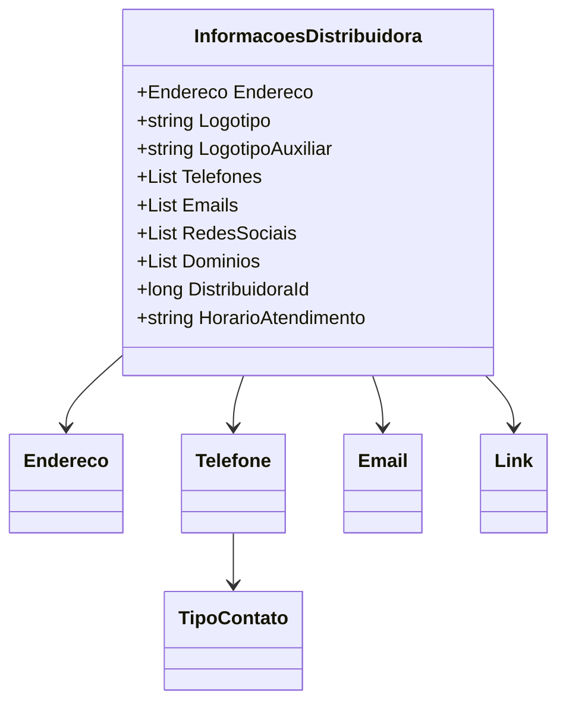

# InformacoesDistribuidora
**Namespace**: IsthmusWinthor.Dominio.POCO.Distribuidoras  
**Nome do Arquivo**: InformacoesDistribuidora.cs  

## Visão Geral e Responsabilidade
A classe `InformacoesDistribuidora` representa as informações detalhadas de uma distribuidora, englobando seu endereço, logotipos, contatos e presença nas redes sociais. Ela tem como objetivo centralizar e estruturar os dados referentes às diversas formas de contato e comunicação, facilitando o gerenciamento e a visualização das informações essenciais para a operação de uma distribuidora.

## Métodos de Negócio

### TelefoneTipo (public)
- **Objetivo**: Este método garante que seja possível acessar o telefone de contato de um determinado tipo para a distribuidora, priorizando sempre a busca por um telefone do tipo especificado.
- **Comportamento**: 
  1. O método recebe um parâmetro `tipoContato` que identifica o tipo desejado de telefone.
  2. Em seguida, ele tenta localizar um telefone na lista `Telefones` que corresponda ao `tipoContato` fornecido.
  3. Se um telefone desse tipo não for encontrado, ele retorna o primeiro telefone disponível na lista.
- **Retorno**: Retorna um objeto do tipo `Telefone`. Se nenhum telefone estiver disponível, o retorno será `null`.

## Propriedades Calculadas e de Validação
- **Nenhuma propriedade com lógica de cálculo ou validação foi identificada nesta classe.**

## Navigations Property
- `[Endereco](Endereco.md)`: Representa o endereço da distribuidora.
- `[Telefone](Telefone.md)`: Representa a classe utilizada para armazenar informações de telefone.
- `[Email](Email.md)`: Representa a classe utilizada para armazenar e-mails da distribuidora.
- `[Link](Link.md)`: Utilizada para representar links para redes sociais e domínios.

## Tipos Auxiliares e Dependências
- `[TipoContato](TipoContato.md)`: Enumerador que define os tipos de contatos disponíveis para telefone.
- `[Endereco](Endereco.md)`: Classe auxiliar que representa o endereço da distribuidora.
- `[Telefone](Telefone.md)`: Classe auxiliar que representa os telefones.
- `[Email](Email.md)`: Classe auxiliar que representa os e-mails.
- `[Link](Link.md)`: Classe auxiliar que representa links para redes sociais e domínios.

## Diagrama de Relacionamentos

