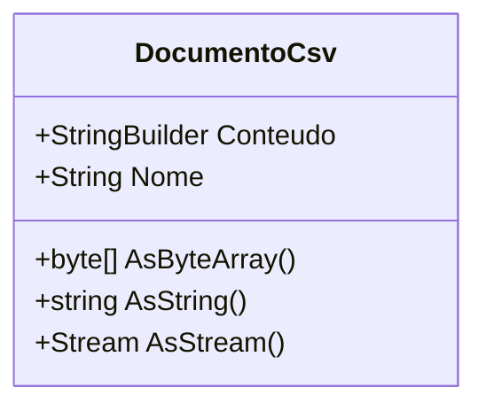

# DocumentoCsv
**Namespace**: IsthmusWinthor.Dominio.POCO  
**Nome do Arquivo**: DocumentoCsv.cs  

## Visão Geral e Responsabilidade
A classe `DocumentoCsv` é uma representação de um documento no formato CSV (Comma-Separated Values). Seu objetivo é permitir a construção, manipulação e conversão de dados estruturados em texto CSV, apoiando a exportação e compartilhamento de dados de maneira simples e eficiente. Esta classe é crucial para cenários onde a transparência e a legibilidade dos dados são fundamentais, como em relatórios ou intercâmbio de informações entre sistemas.

## Métodos de Negócio

### Título: AsByteArray() - Public
- **Objetivo**: Este método garante a transformação do conteúdo CSV armazenado em um array de bytes, facilitando o transporte e a transmissão de dados.
- **Comportamento**: 
  1. Chama o método `ToString()` no `StringBuilder` `Conteudo` para obter a representação em string do documento CSV.
  2. Utiliza `Encoding.UTF8.GetBytes()` para converter a string em um array de bytes, apropriado para transmissão em formatos binários.
- **Retorno**: Retorna um array de bytes que representa o conteúdo do documento CSV.

### Título: AsString() - Public
- **Objetivo**: Prover uma versão em string do conteúdo do documento CSV, permitindo que os dados sejam lidos em formato legível.
- **Comportamento**: 
  1. Chama o método `ToString()` em `Conteudo`, retornando a string que representa todos os dados CSV.
- **Retorno**: Retorna a representação em string do conteúdo do documento CSV.

### Título: AsStream() - Public
- **Objetivo**: Oferecer uma forma de acessar o conteúdo do documento CSV como um fluxo de dados, que pode ser útil para operações de IO.
- **Comportamento**: 
  1. Chama `AsByteArray()` para obter o array de bytes correspondente ao conteúdo do CSV.
  2. Cria um `MemoryStream` a partir do array de bytes retornado.
  3. Ajusta a posição do `MemoryStream` para zero, preparando-o para leitura.
- **Retorno**: Retorna um objeto `Stream` que representa o conteúdo do documento CSV.

## Propriedades Calculadas e de Validação

### Nome
- A propriedade `Nome` é definida como privada na configuração de seu setter, tornando-a apenas definível durante a construção do objeto. Isso garante que o nome do documento não seja alterado após a criação, assegurando a integridade dos dados representados pelo documento CSV.

## Navigations Property
- Não existem navigations properties definidas nesta classe.

## Tipos Auxiliares e Dependências
- Nenhum tipo auxiliar, enumerador ou classe estática é utilizado nesta classe.

## Diagrama de Relacionamentos

A documentação acima fornece uma visão clara sobre as regras de negócio, integridade de dados e a arquitetura subjacente da classe `DocumentoCsv`, permitindo uma fácil compreensão e manutenção do código dentro do sistema corporativo.
