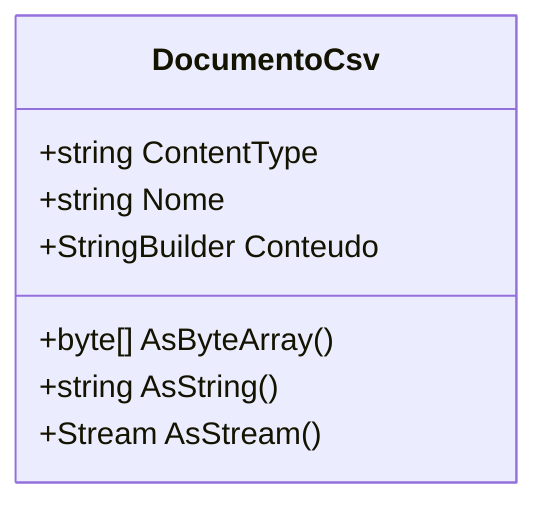

# DocumentoCsv
- **Namespace**: IsthmusWinthor.Dominio.POCO
- **Nome do Arquivo**: DocumentoCsv.cs

## Visão Geral e Responsabilidade
A classe `DocumentoCsv` é responsável por representar e manipular um documento CSV no domínio da aplicação, permitindo a criação, conversão e exportação de dados no formato CSV. Ela aborda a necessidade de estruturar dados tabulares de forma que possam ser facilmente transferidos e utilizados em outros sistemas ou aplicações, ao mesmo tempo que garante a integridade do conteúdo do arquivo.

## Métodos de Negócio

### Título: AsByteArray (Público)
- **Objetivo**: Converte o conteúdo do documento CSV em um array de bytes para facilitar a transmissão ou armazenamento do arquivo.
- **Comportamento**: 
  1. Chama o método `ToString` do `StringBuilder` que contém o conteúdo do CSV.
  2. Utiliza a codificação UTF-8 para converter a string resultante em um array de bytes.
- **Retorno**: Retorna um array de bytes que representa o conteúdo do documento em formato CSV.

### Título: AsString (Público)
- **Objetivo**: Retorna o conteúdo do documento CSV como uma string.
- **Comportamento**: 
  1. Chama o método `ToString` do `StringBuilder` que contém o conteúdo do CSV.
- **Retorno**: Retorna uma string que representa o conteúdo do documento CSV.

### Título: AsStream (Público)
- **Objetivo**: Converte o conteúdo do documento CSV em um `Stream` para facilitar a manipulação de dados, especialmente para operações de leitura ou gravação em arquivos.
- **Comportamento**: 
  1. Chama o método `AsByteArray` para obter o conteúdo em forma de array de bytes.
  2. Inicializa um `MemoryStream` com o array de bytes.
  3. Define a posição do stream como zero.
- **Retorno**: Retorna um `Stream` que contém o conteúdo do documento CSV.

## Propriedades Calculadas e de Validação
### Propriedade: ContentType
- **Regra**: A propriedade `ContentType` é uma propriedade calculada que retorna o tipo de conteúdo do arquivo, fixando-se como "text/csv", o que é fundamental para identificar o formato do arquivo em uma operação de upload ou download.

## Navigations Property
- Não há propriedades de navegação complexas nesta classe.

## Tipos Auxiliares e Dependências
- Nenhum enumerador ou classe auxiliar externa é utilizado.

## Diagrama de Relacionamentos

---
Gerada em 29/12/2025 21:32:50
