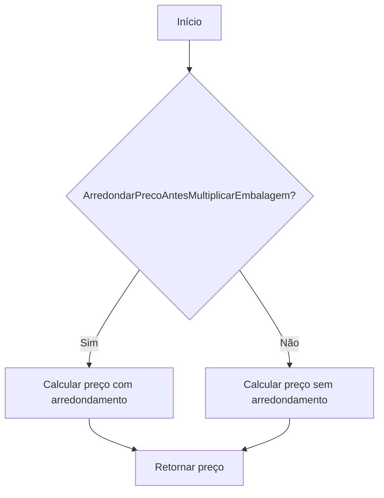

# Embalagem
**Namespace**: IsthmusWinthor.Dominio.POCO  
**Nome do Arquivo**: Embalagem.cs  

## Visão Geral e Responsabilidade
A classe `Embalagem` representa um modelo de domínio que encapsula informações e comportamentos relacionados a embalagens de produtos. O principal problema de negócio que esta classe resolve é o cálculo do preço de uma determinada embalagem de produto, considerando diferentes fatores como o fator de preço, a quantidade unitaria da embalagem e regras de arredondamento. Esta lógica assegura que o preço final refletido na operação de venda seja correto e aderente às políticas de precificação da organização.

## Métodos de Negócio

### PrecoEmbalagem (public)
- **Objetivo**: Este método garante que o preço da embalagem é calculado corretamente com base na política de arredondamento e no fator de preço, assegurando uma precisão apropriada no valor final apresentado ao cliente.
- **Comportamento**: 
  1. Inicializa `precoEmbalagem` com zero.
  2. Determina o `fatorPreco` a ser utilizado com base no parâmetro `usarFatorPreco`.
  3. Avalia se o parâmetro `ArredondarPrecoAntesMultiplicarEmbalagem` é verdadeiro.
     - Se verdadeiro, aplica o arredondamento no resultado da multiplicação entre `preco` e `fatorPreco`, utilizando a quantidade de casas decimais especificadas. Em seguida, multiplica pelo `QuantidadeUnitaria`.
     - Se falso, simplesmente multiplica `preco`, `fatorPreco` e `QuantidadeUnitaria`.
  4. Retorna o `precoEmbalagem` calculado.
- **Retorno**: Retorna um `decimal` que representa o preço final da embalagem, considerando as regras de arredondamento e multiplicação.

## Propriedades Calculadas e de Validação
- Não há propriedades que contenham lógica no `get` ou validação no `set`.

## Navigations Property
- Não há propriedades que sejam classes complexas do domínio.

## Tipos Auxiliares e Dependências
- Utiliza o enumerador [TipoEmbalagemEnum](TipoEmbalagemEnum.md) para determinar o tipo de embalagem.

## Diagrama de Relacionamentos

---
Gerada em 29/12/2025 21:33:05
