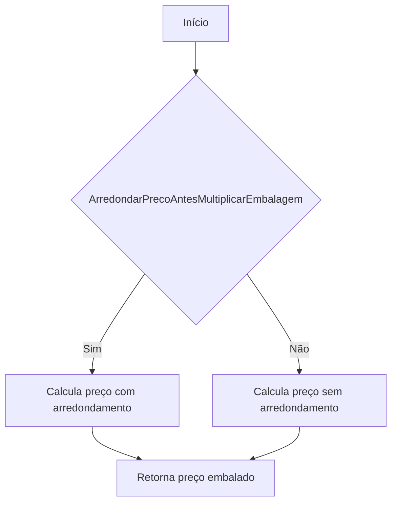
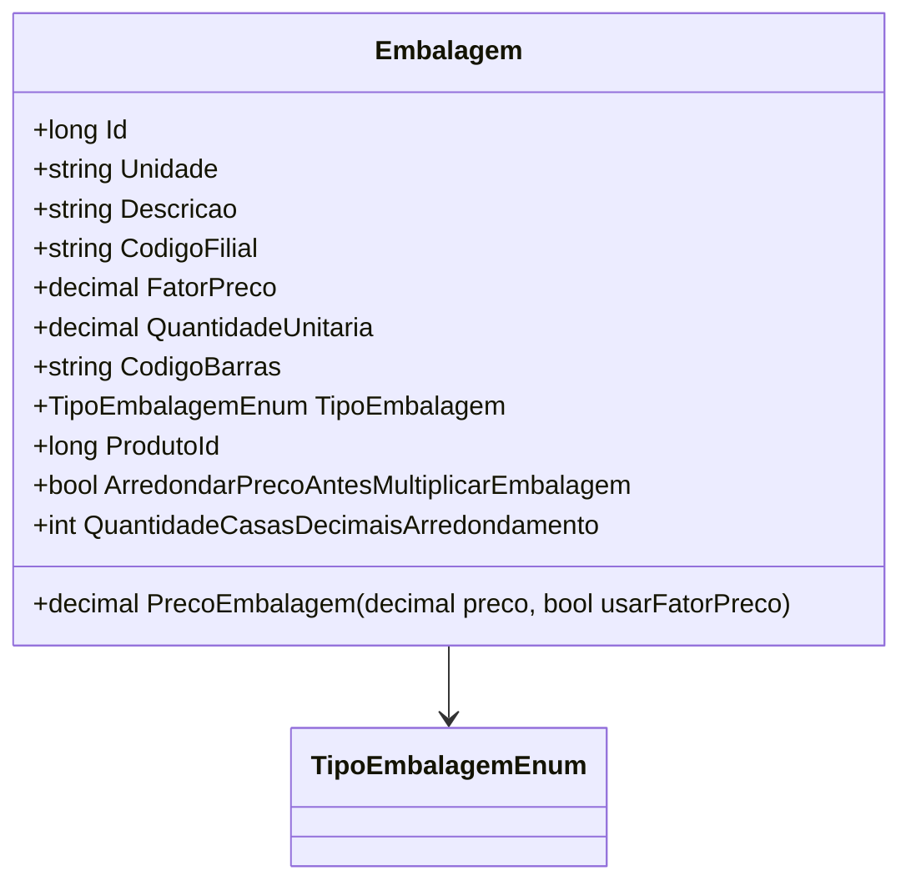

# Embalagem

**Namespace**: IsthmusWinthor.Dominio.POCO  
**Nome do Arquivo**: Embalagem.cs  

## Visão Geral e Responsabilidade
A classe `Embalagem` representa o conceito de embalagem de um produto dentro do sistema. Ela é responsável por calcular o preço de uma embalagem a partir do preço unitário do produto, considerando diversos parâmetros como o fator de preço e a quantidade de unidades por embalagem. Este cálculo é essencial para garantir a integridade dos preços apresentados aos clientes, assegurando que todos os fatores envolvidos na embalagem do produto sejam considerados corretamente.

## Métodos de Negócio

### PrecoEmbalagem - Public
- **Objetivo**: Garantir que o cálculo do preço da embalagem esteja correto, considerando se o preço deve ser arredondado e o fator de preço aplicável.
- **Comportamento**: 
  1. Inicializa a variável `precoEmbalagem` como 0.
  2. Determina o `fatorPreco` com base na flag `usarFatorPreco`.
  3. Verifica se a flag `ArredondarPrecoAntesMultiplicarEmbalagem` está ativa.
     - Se ativa:
       - Calcula o preço multiplicando o `preco` pelo `fatorPreco`, arredonda o resultado de acordo com `QuantidadeCasasDecimaisArredondamento` e multiplica pelo `QuantidadeUnitaria`.
     - Se não ativa:
       - Calcula o preço diretamente multiplicando o `preco`, `fatorPreco` e `QuantidadeUnitaria`.
  4. Retorna o valor calculado para `precoEmbalagem`.
- **Retorno**: Retorna o preço final da embalagem como um valor decimal, que pode ser utilizado para definição de preços ao consumidor.

## Propriedades Calculadas e de Validação
- **ArredondarPrecoAntesMultiplicarEmbalagem**: Esta propriedade indica se o preço deve ser arredondado antes da multiplicação. A regra de negócio garante que, se o arredondamento for necessário, seja feito com precisão especificada em `QuantidadeCasasDecimaisArredondamento`.
  
## Navigations Property
- [TipoEmbalagem](TipoEmbalagem.md): Enum que define os tipos de embalagem disponíveis.

## Tipos Auxiliares e Dependências
- [TipoEmbalagemEnum](TipoEmbalagemEnum.md): Enum necessário para definir o tipo de embalagem.

## Diagrama de Relacionamentos

