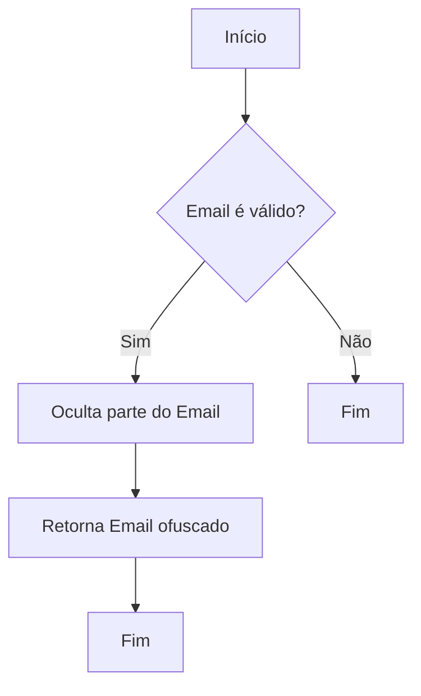
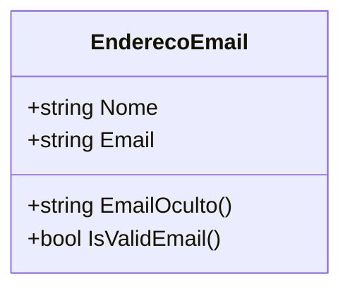

# EnderecoEmail
**Namespace**: IsthmusWinthor.Dominio.POCO  
**Nome do Arquivo**: EnderecoEmail.cs  

## Visão Geral e Responsabilidade
A classe `EnderecoEmail` representa um modelo de domínio para gerenciar informações de endereços de e-mail. Ela encerra a lógica necessária para validar um e-mail e pode ocultar parte do endereço, resolvendo a necessidade de manipulação segura de dados sensíveis de contato.

## Métodos de Negócio

### Título: EmailOculto() - Público
- **Objetivo**: Protege a privacidade do endereço de e-mail, ocultando parte do mesmo.
- **Comportamento**: 
  1. Utiliza uma expressão regular para identificar partes do endereço de e-mail que devem ser ofuscadas.
  2. Substitui essas partes por asteriscos `*`, garantindo que apenas os primeiros e últimos caracteres sejam expostos.
  3. Retorna o endereço de e-mail ofuscado para visualização.
  
- **Retorno**: Retorna uma string que representa o endereço de e-mail com parte dos caracteres ocultados.

### Título: IsValidEmail() - Público
- **Objetivo**: Garante que o e-mail fornecido é válido de acordo com as regras de formatação.
- **Comportamento**: 
  1. Tenta criar uma instância de `MailAddress` utilizando o e-mail armazenado.
  2. Se a criação da instância for bem-sucedida, considera o e-mail válido e retorna true.
  3. Caso contrário, uma exceção de formato é capturada e false é retornado.
  
- **Retorno**: Retorna um valor booleano indicando se o endereço de e-mail possui um formato válido.

## Propriedades Calculadas e de Validação
Nenhuma propriedade nesse modelo contêm lógica no `get` ou validação no `set`.

## Navigations Property
Não há propriedades que são complexas do domínio.

## Tipos Auxiliares e Dependências
- Dependência de `System.Net.Mail.MailAddress` para validação de e-mail.
- Nenhum enumerador ou classe auxiliar foi utilizado diretamente na classe.

## Diagrama de Relacionamentos

Este documento delineia os aspectos principais da classe `EnderecoEmail`, suas responsabilidades, métodos de negócio e suas relações, fornecendo um guia claro e técnico para entendimento e utilização deste componente do domínio.
---
Gerada em 29/12/2025 21:33:18
