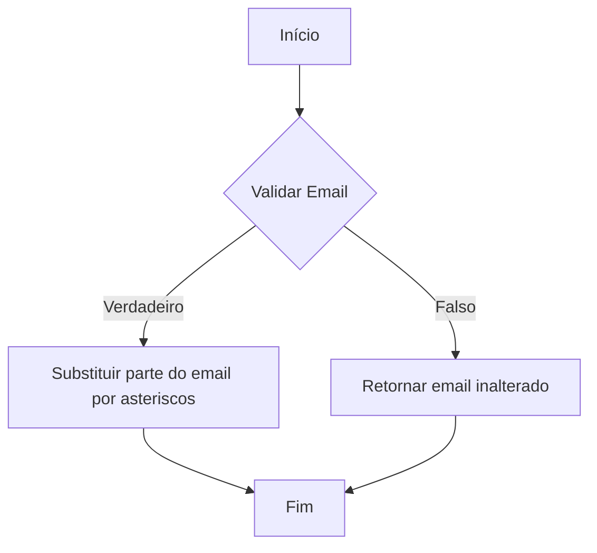
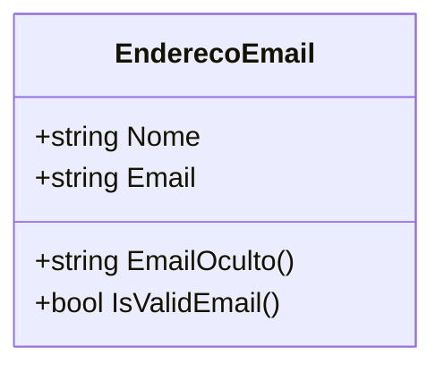

# EnderecoEmail
**Namespace**: IsthmusWinthor.Dominio.POCO  
**Nome do Arquivo**: EnderecoEmail.cs  

## Visão Geral e Responsabilidade
A classe `EnderecoEmail` representa um endereço de email, encapsulando tanto o email quanto um nome associado. O objetivo principal dessa classe é garantir a integridade e a validade dos endereços de email utilizados dentro do sistema, permitindo validar e ocultar partes do email para operações de segurança e privacidade.

## Métodos de Negócio

### EmailOculto()
- **Objetivo**: Este método garante a ocultação parcial do endereço de email, substituindo parte do nome de usuário por asteriscos (*), visando proteger a privacidade do usuário em contextos onde o email é exibido publicamente.
- **Comportamento**: 
  1. Aplica-se uma expressão regular para identificar a parte do email que deve ser ocultada.
  2. A parte do email entre o primeiro e o último caractere do nome de usuário é substituída por asteriscos, enquanto o domínio permanece visível.
- **Retorno**: Retorna uma string representando o email oculto. Por exemplo, `j***@gmail.com`.

### IsValidEmail()
- **Objetivo**: Este método assegura que o endereço de email fornecido esteja no formato válido, seguindo as especificações da RFC 5321 e RFC 5322.
- **Comportamento**:
  1. Tenta instanciar um objeto `MailAddress` com o email atual.
  2. Se o formato for inválido, uma exceção `FormatException` é lançada.
  3. Retorna `true` se o email for válido e `false` caso contrário.
- **Retorno**: Retorna um valor booleano que indica a validade do email.

## Propriedades Calculadas e de Validação
- Não há propriedades com lógica de cálculo ou validação explícita, uma vez que os validadores estão concentrados nos métodos de negócio.

## Navigation Property
- Não há propriedades de navegação que representem outras classes do domínio.

## Tipos Auxiliares e Dependências
- Utiliza a classe `MailAddress` como dependência para validação de endereços de email.

## Diagrama de Relacionamentos

