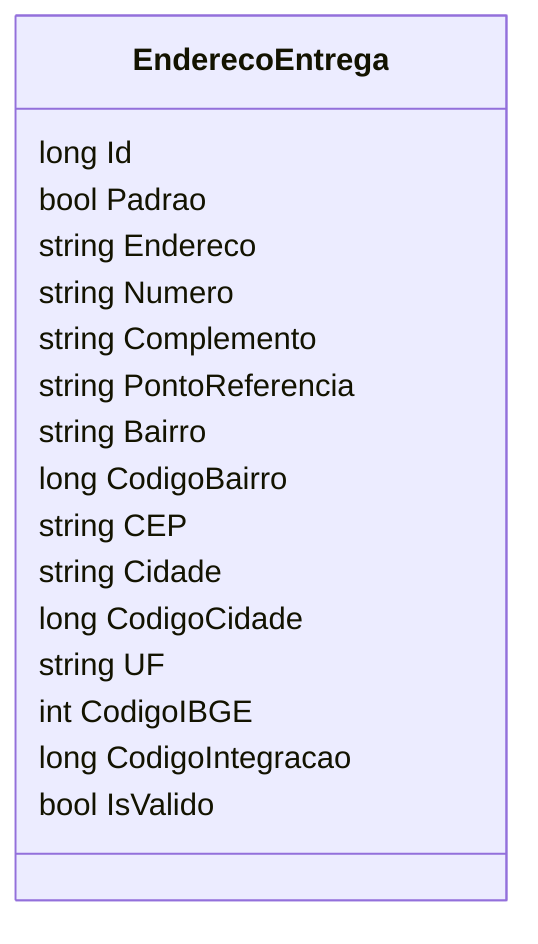

# EnderecoEntrega
**Namespace**: IsthmusWinthor.Dominio.POCO  
**Nome do Arquivo**: EnderecoEntrega.cs  

Endereço de Entrega representa os dados necessários para a entrega dos produtos, assegurando que as informações sobre o local estejam disponíveis para processamento e logística.

## Propriedades Calculadas e de Validação
- **IsValido**: 
  - **Regra**: Determina se o endereço é válido com base na presença de um CEP preenchido. Se o CEP não estiver vazio, o endereço é considerado válido, o que é crucial para garantir que as entregas sejam feitas corretamente.

## Navigations Property
- Não há propriedades que representem classes complexas do domínio nesta classe.

## Tipos Auxiliares e Dependências
- Não há enumeradores ou classes estáticas/helpers utilizadas nesta classe.

## Diagrama de Relacionamentos

