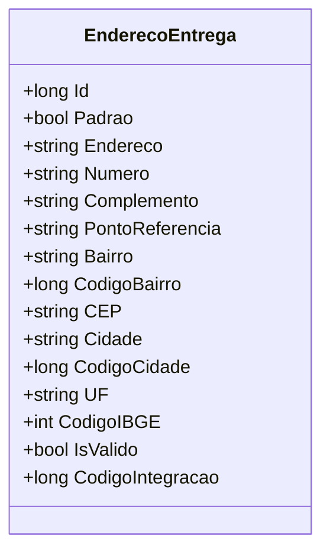

# EnderecoEntrega
- **Namespace**: IsthmusWinthor.Dominio.POCO
- **Nome do Arquivo**: EnderecoEntrega.cs

## Visão Geral e Responsabilidade
A classe `EnderecoEntrega` representa um endereço onde os produtos devem ser entregues no contexto de um sistema de gerenciamento de clientes e pedidos. Ela é responsável por armazenar informações relevantes sobre o local de entrega, assegurando que todos os endereços estão corretamente estruturados e que informações essenciais, como o CEP, estão disponíveis e válidas. A sua atuação é fundamental para garantir uma logística de entrega precisa e eficiente.

## Métodos de Negócio
### Título: IsValido (Propriedade)
- **Objetivo**: Garante que o endereço contém um CEP válido para que ele possa ser considerado aceito e utilizável para processos de entrega.
- **Comportamento**: 
  1. A propriedade `IsValido` verifica se a string `CEP` não está vazia ou nula.
  2. Se a condição for verdadeira, o método retorna `true`, indicando que o endereço é válido.
  3. Caso contrário, retorna `false`, indicando que o endereço não pode ser usado para entrega.
- **Retorno**: `true` se o `CEP` estiver preenchido, caso contrário, `false`.

## Propriedades Calculadas e de Validação
- **IsValido**: Esta propriedade calcula a validade do endereço com base no preenchimento do `CEP`. A regra é que um endereço só é considerado válido se o `CEP` possui um valor preenchido, essencial para a entrega.

## Navigation Property
- Nenhuma propriedade de navegação complexa foi identificada nesta classe.

## Tipos Auxiliares e Dependências
- Nenhum enumerador ou tipo auxiliar específico foi utilizado nesta classe.

## Diagrama de Relacionamentos

---
Gerada em 29/12/2025 21:33:29
