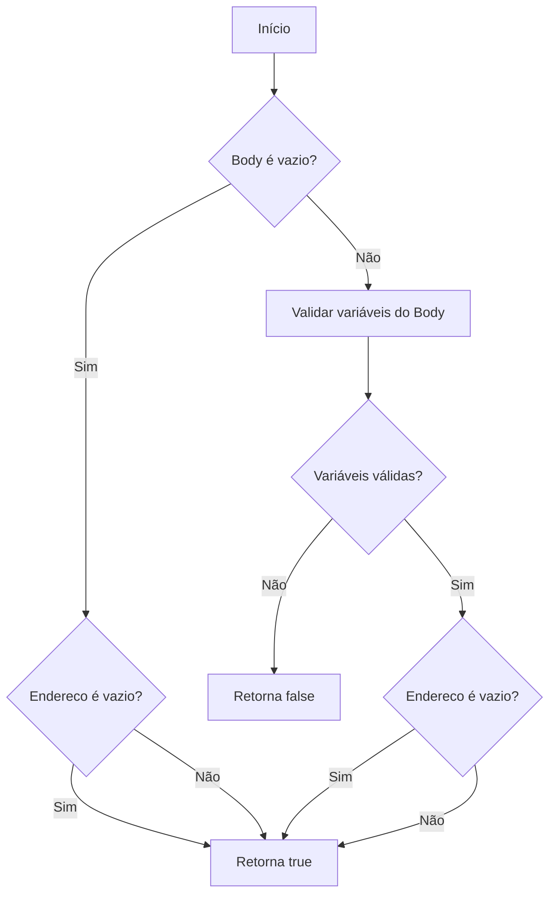
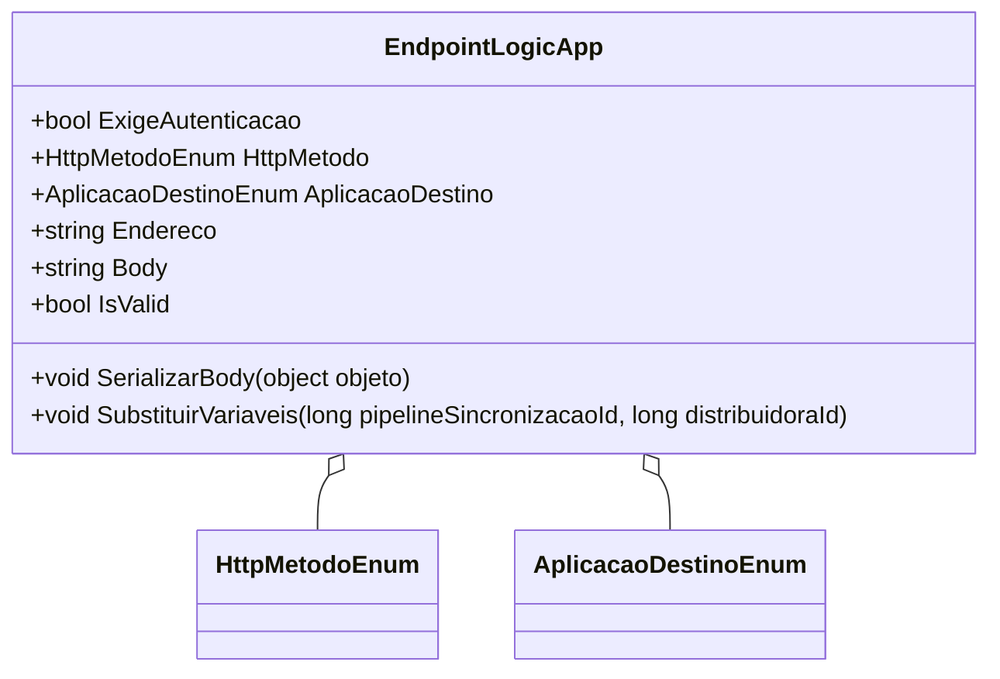

# EndpointLogicApp
**Namespace**: IsthmusWinthor.Dominio.POCO  
**Nome do Arquivo**: EndpointLogicApp.cs

## Visão Geral e Responsabilidade
A classe `EndpointLogicApp` representa uma configuração de um endpoint em um sistema de integração via Logic Apps. Seu papel é gerenciar as propriedades do endpoint, como a necessidade de autenticação, o método HTTP a ser utilizado e a URL do endpoint, além de gerenciar a serialização do corpo da requisição e a substituição de variáveis dinâmicas. Ela resolve o problema de integração de dados entre diferentes aplicações, garantindo que as informações necessárias sejam formatadas e substituídas corretamente antes do envio.

## Métodos de Negócio

### Título: `IsValid` (Visibilidade: Pública)
- **Objetivo**: Garante que as informações do endpoint (URL e corpo) estejam devidamente preenchidas e que todas as variáveis necessárias foram substituídas corretamente.
- **Comportamento**:
  1. Obtém as variáveis que podem ser substituídas através do método `ObterVariaveisParaSubstituicao`.
  2. Se o `Body` não está vazio, valida se todas as variáveis necessárias foram substituídas.
  3. Verifica se o `Endereco` não está vazio e se todas as suas variáveis foram também validadas.
- **Retorno**: Retorna `true` se o endpoint é válido, ou `false` caso contrário.

### Título: `SerializarBody` (Visibilidade: Pública)
- **Objetivo**: Serializa um objeto para JSON e o atribui à propriedade `Body`.
- **Comportamento**: Utiliza a biblioteca `JsonConvert` para converter o objeto fornecido em uma string JSON e a armazena em `Body`.
- **Retorno**: Não retorna valor.

### Título: `SubstituirVariaveis` (Visibilidade: Pública)
- **Objetivo**: Substitui variáveis no `Body` e no `Endereco` por valores específicos de ID.
- **Comportamento**:
  1. Cria um dicionário de variáveis com os IDs fornecidos.
  2. Substitui as variáveis correspondentes no `Body` e no `Endereco` utilizando o método `SubstituirVariaveis`.
- **Retorno**: Não retorna valor.

### Título: `ValidarVariaveisSubstituidas` (Visibilidade: Privada)
- **Objetivo**: Verifica se todas as variáveis necessárias foram substituídas na informação fornecida.
- **Comportamento**: Itera sobre as variáveis para confirmar que nenhuma delas permanece na informação.
- **Retorno**: Retorna `true` se todas as variáveis foram substituídas, ou `false` caso contrário.

### Título: `SubstituirVariaveis` (Visibilidade: Privada)
- **Objetivo**: Realiza a substituição das variáveis no texto fornecido.
- **Comportamento**: Utiliza um `StringBuilder` para realizar substituições das variáveis por seus respectivos valores.
- **Retorno**: Retorna a string modificada com as variáveis substituídas.

### Título: `CriarDicionario` (Visibilidade: Privada)
- **Objetivo**: Cria um dicionário com as variáveis e seus valores correspondentes.
- **Comportamento**: Preenche um dicionário com os IDs recebidos e as respectivas chaves.
- **Retorno**: Retorna um dicionário contendo as variáveis com seus valores.

### Título: `ObterVariaveisParaSubstituicao` (Visibilidade: Privada)
- **Objetivo**: Obtém uma lista de chaves das variáveis que podem ser substituídas.
- **Comportamento**: Chamando o método `CriarDicionario`, extrai as chaves dessas variáveis para uma lista.
- **Retorno**: Retorna uma coleção de strings representando as variáveis que precisam ser substituídas.

## Propriedades Calculadas e de Validação
- **IsValid**: A propriedade realiza validações na URL e no corpo, assegurando que nenhum placeholder permaneça sem substituição antes que o endpoint seja considerado válido.

## Navigations Property
- Esta classe não contém propriedades que sejam classes complexas do domínio.

## Tipos Auxiliares e Dependências
- `[HttpMetodoEnum](HttpMetodoEnum.md)`
- `[AplicacaoDestinoEnum](AplicacaoDestinoEnum.md)`

## Diagrama de Relacionamentos

