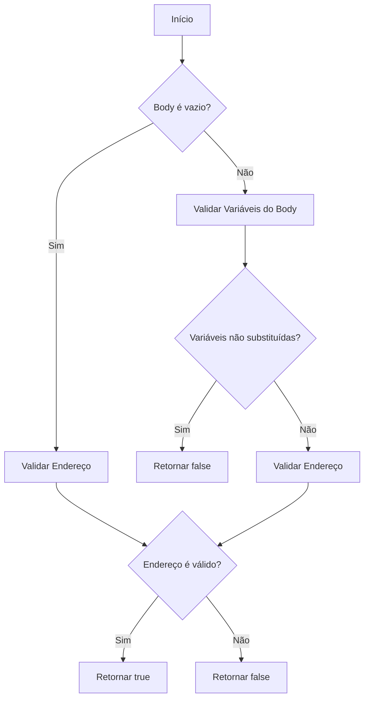
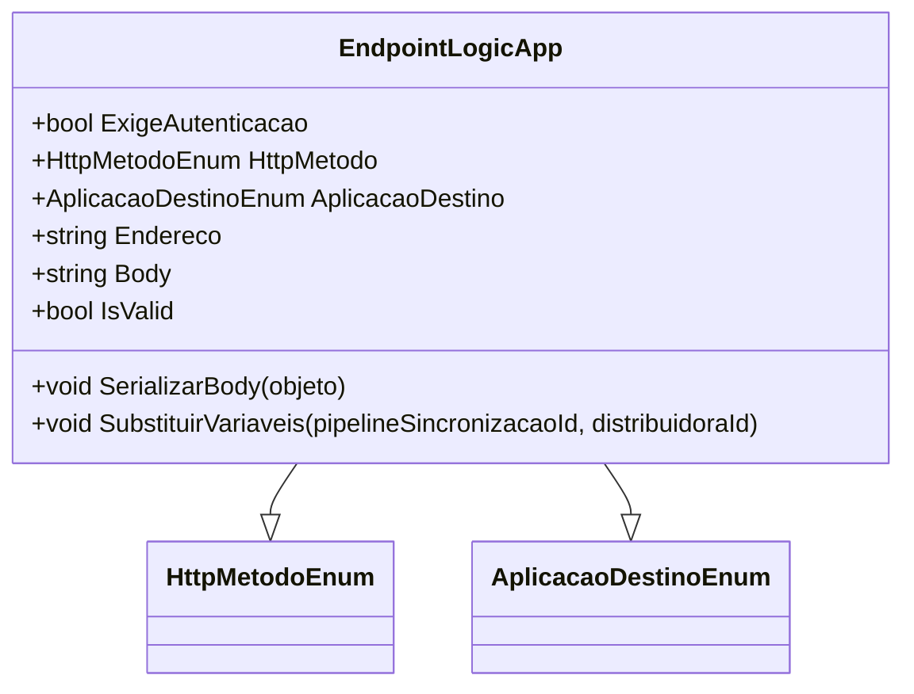

# EndpointLogicApp
**Namespace**: IsthmusWinthor.Dominio.POCO  
**Nome do Arquivo**: EndpointLogicApp.cs  

## Visão Geral e Responsabilidade
A classe `EndpointLogicApp` é responsável por definir a lógica de um endpoint em uma aplicação, incluindo a configuração de autenticação, método HTTP, endereço, corpo da requisição e validação das variáveis utilizadas nas URLs e no corpo. Isso permite que o sistema efetue chamadas a outros serviços de maneira dinâmica, assegurando que as variáveis relevantes sejam substituídas corretamente, de acordo com as regras de negócio definidas, aumentando a flexibilidade e a integridade dos dados manipulados.

## Métodos de Negócio

### Título: `IsValid` (Propriedade)
- **Objetivo**: Garante que o endpoint possui um endereço válido e que o corpo e o endereço não contêm variáveis não substituídas.
- **Comportamento**:
  1. Obtém a lista de variáveis que podem ser substituídas através do método `ObterVariaveisParaSubstituicao()`.
  2. Se o corpo (`Body`) não estiver vazio, valida se todas as variáveis foram corretamente substituídas utilizando o método `ValidarVariaveisSubstituidas()`.
  3. Retorna `false` se o corpo tiver variáveis não substituídas.
  4. Valida o `Endereco` utilizando o mesmo método de validação e retorna `true` apenas se todas as condições forem atendidas.
- **Retorno**: `bool` - `true` se o endpoint for válido (endereço preenchido e variável de corpo substituídas), `false` caso contrário.

### Título: `SerializarBody` (Público)
- **Objetivo**: Transforma um objeto em formato JSON e o armazena na propriedade `Body`.
- **Comportamento**: Utiliza o `JsonConvert.SerializeObject()` para serializar o objeto passado como parâmetro e atribui o resultado à propriedade `Body`.
- **Retorno**: Não retorna valor.

### Título: `SubstituirVariaveis` (Público)
- **Objetivo**: Substitui as variáveis dentro do `Body` e `Endereco` com os valores apropriados, usando o ID da sincronização e o ID da distribuidora.
- **Comportamento**:
  1. Chama `CriarDicionario()` para obter um dicionário com os IDs.
  2. Utiliza o método `SubstituirVariaveis()` para substituir as variáveis no `Body` e no `Endereco` com seus respectivos valores.
- **Retorno**: Não retorna valor.

### Título: `ValidarVariaveisSubstituidas` (Privado)
- **Objetivo**: Verifica se todas as variáveis presentes em uma string foram substituídas.
- **Comportamento**: Para cada variável no dicionário de variáveis, verifica se a string contém a variável não substituída e retorna `false` se alguma for encontrada.
- **Retorno**: `bool` - `true` se todas as variáveis foram substituídas, `false` caso contrário.

### Título: `SubstituirVariaveis` (Privado)
- **Objetivo**: Substitui todas as ocorrências das variáveis em uma string pelos seus valores correspondentes.
- **Comportamento**: Cria um `StringBuilder` para manipulação eficiente de strings e substitui cada variável na string original pelo seu valor correspondente.
- **Retorno**: `string` - Retorna a string modificada.

### Título: `CriarDicionario` (Privado)
- **Objetivo**: Cria um dicionário com as variáveis necessárias para substituição e seus valores correspondentes.
- **Comportamento**: Adiciona as variáveis relacionadas ao `pipelineId` e `distribuidoraId` ao dicionário e o retorna.
- **Retorno**: `Dictionary<string, string>` - Um dicionário com as variáveis e valores.

### Título: `ObterVariaveisParaSubstituicao` (Privado)
- **Objetivo**: Obtém uma lista das variáveis que podem ser utilizadas na substituição.
- **Comportamento**: Chama `CriarDicionario()` e seleciona as chaves (variáveis) desse dicionário, retornando-as como uma lista.
- **Retorno**: `IEnumerable<string>` - Uma lista de strings representando as variáveis.

## Propriedades Calculadas e de Validação
- **IsValid**: Verifica se o `Endereco` não é vazio e se todas as variáveis de `Body` e `Endereco` foram devidamente substituídas, garantindo a integridade da informação antes de uma requisição ser realizada.

## Navigations Property
- [HttpMetodoEnum](HttpMetodoEnum.md)
- [AplicacaoDestinoEnum](AplicacaoDestinoEnum.md)

## Tipos Auxiliares e Dependências
- [HttpMetodoEnum](HttpMetodoEnum.md)
- [AplicacaoDestinoEnum](AplicacaoDestinoEnum.md)

## Diagrama de Relacionamentos

---
Gerada em 29/12/2025 21:33:56
