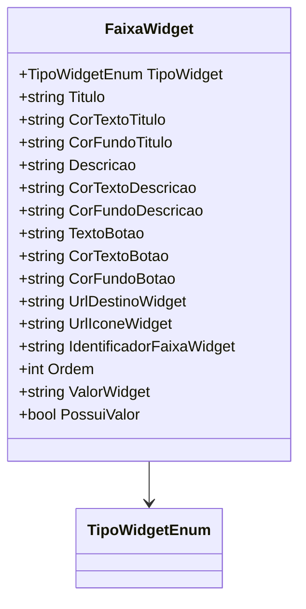

# FaixaWidget
**Namespace**: IsthmusWinthor.Dominio.POCO  
**Nome do Arquivo**: FaixaWidget.cs  

## Visão Geral e Responsabilidade
A classe `FaixaWidget` representa uma configuração de widget que pode ser utilizada em uma interface de usuário em uma aplicação B2B. Ela resolve o problema de personalização da apresentação de informações ao usuário logado, permitindo que diferentes tipos de widgets sejam exibidos de forma dinâmica, com base em configurações visuais e conteúdo que se ajusta ao contexto do cliente.

## Métodos de Negócio

### Título: `PossuiValor` (Propriedade)
- **Objetivo**: Garante que a verificação se um widget possui um valor válido seja realizada, permitindo que apenas widgets que são genéricos ou que tenham valores específicos sejam considerados válidos para exibição.
- **Comportamento**: 
    1. Avalia se o `TipoWidget` é do tipo `Generico`.
    2. Se não for, verifica se o `ValorWidget` não está nulo ou vazio.
- **Retorno**: Retorna um valor booleano que indica a presença de um valor no widget.

## Propriedades Calculadas e de Validação
- **`PossuiValor`**: Esta propriedade possui lógica embutida em sua avaliação, assegurando que um widget é considerado válido quando atende a uma das duas condições definidas (tipo genérico ou valor informado).

## Navigations Property
Não há propriedades que sejam classes complexas do domínio dentro da `FaixaWidget`.

## Tipos Auxiliares e Dependências
- [TipoWidgetEnum](TipoWidgetEnum.md): Enum usado para definir o tipo do widget.

## Diagrama de Relacionamentos

