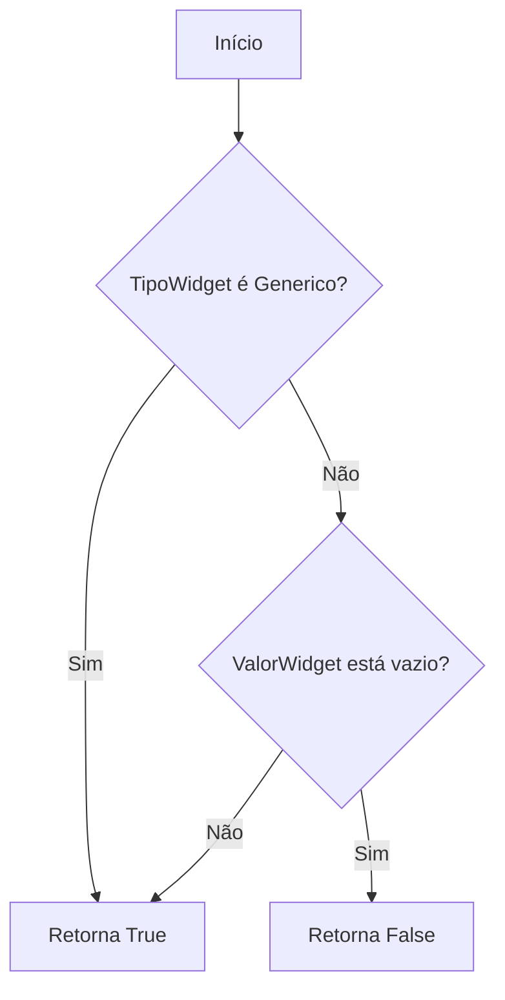
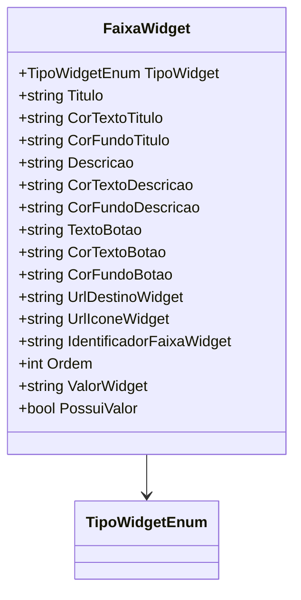

# FaixaWidget
**Namespace**: IsthmusWinthor.Dominio.POCO  
**Nome do Arquivo**: FaixaWidget.cs  

## Visão Geral e Responsabilidade
A classe `FaixaWidget` atua como um modelo de domínio que representa um conjunto de informações para um widget exibido em uma interface de usuário. O seu principal objetivo é armazenar e organizar os dados necessários para a renderização de um widget na UI, incluindo o tipo de widget, título, descrição, cores, botões e URLs. Essa classe é fundamental para garantir a integridade e a apresentação dos dados do widget de maneira consistente e controlada.

## Métodos de Negócio

### Título: PossuiValor (Método Público)
- **Objetivo**: Verifica se o widget possui valor suficiente para ser considerado válido ou utilizável na interface.
- **Comportamento**: 
  1. Verifica se o `TipoWidget` é um dos tipos genéricos definidos na enumeração `TipoWidgetEnum`.
  2. Caso contrário, verifica se o `ValorWidget` não está vazio ou nulo.
- **Retorno**: Retorna um valor booleano que indica a presença de um valor relevante para o widget. True se o widget possui valor; caso contrário, False.

## Propriedades Calculadas e de Validação

### Propriedade: `PossuiValor`
- **Regra**: Esta propriedade calcula se o widget é considerado válido com base no seu tipo e na presença de um valor específico. Se o tipo for genérico ou se um valor foi definido para o widget, considera-se que o widget possui valor.

## Navigations Property
Não existem propriedades complexas de navegação que referenciam outras classes de domínio.

## Tipos Auxiliares e Dependências
- **Enumeradores**:
  - [TipoWidgetEnum](TipoWidgetEnum.md)

## Diagrama de Relacionamentos

---
Gerada em 29/12/2025 21:34:10
