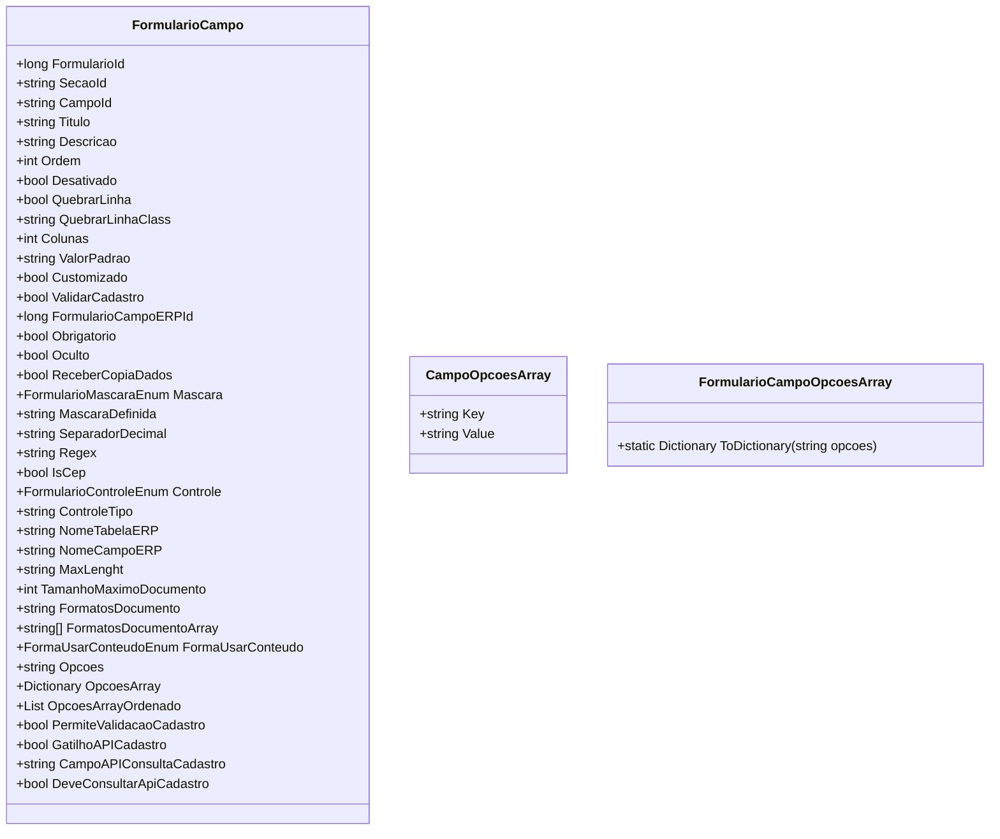

# FormularioCampo
**Namespace**: IsthmusWinthor.Dominio.POCO.Formulario  
**Nome do Arquivo**: FormularioCampo.cs  

## Visão Geral e Responsabilidade
A classe `FormularioCampo` representa um campo em um formulário que pode ser usado para coleta de dados. Ela encapsula informações sobre como o campo deve ser apresentado e manipulá-lo, garantindo que as regras de negócio associadas ao preenchimento dos campos sejam respeitadas. Essa classe é fundamental para a criação dinâmica de interfaces de formulários em sistemas corporativos, permitindo a customização de campos conforme necessidades específicas de validação e apresentação.

## Métodos de Negócio

### Título: `OpcoesArray`
- **Objetivo**: Garante a estruturação das opções do campo em um formato chave-valor a partir de uma string de opções.
- **Comportamento**:
  1. Verifica se a string `Opcoes` está vazia.
  2. Se não estiver, divide a string em linhas.
  3. Para cada linha, divide em chave e valor com base no delimitador.
  4. Adiciona cada par chave-valor a um dicionário, evitando duplicatas.
- **Retorno**: Retorna um `Dictionary<string, string>` com as chaves e valores das opções disponíveis.

### Título: `MascaraDefinida`
- **Objetivo**: Retorna a máscara que deve ser utilizada para validação e formatação dos dados do campo, dependendo do tipo de máscara definido.
- **Comportamento**:
  1. Avalia o tipo de máscara configurado na propriedade `Mascara`.
  2. Retorna a máscara correspondente com base na enumeração `FormularioMascaraEnum`.
- **Retorno**: Retorna uma string representando a máscara adequada para o campo, ou uma string vazia se a máscara for do tipo "Livre".

```mermaid
flowchart TD
    A[Inicio] --> B{Tipo de Máscara}
    B -->|Livre| C[Retornar String Vazia]
    B -->|CEP| D[Retornar 00000-000]
    B -->|CNPJ| E[Retornar 00.000.000/0000-00]
    B -->|CPF| F[Retornar 000.000.000-00]
    B -->|Telefone Fixo| G[Retornar (00) 0000-0000]
    B -->|Celular| H[Retornar (00) 00000-0000]
    B -->|Inteiro| I[Gerar Máscara Inteiro]
    B -->|Decimal| J[Retornar separator.3]
    B -->|Reais| K[Retornar separator.2]
    B -->|Percentual| L[Retornar percent]
    B -->|Data| M[Retornar 00/00/0000]
    B --> N[Retornar String Vazia]
```

## Propriedades Calculadas e de Validação

### Propriedades com Lógica no Get
- **`ClassColunas`**: Retorna a classe CSS correspondente ao número de colunas que o campo deve ocupar na tela. Garante que o número mínimo de colunas seja 1.
  
### Propriedades com Validação no Set
- **`MaxLenght`**: Poderia incluir validações específicas para garantir que o tamanho máximo não seja excedido, embora não esteja expresso.

## Navigations Property
- Não existem propriedades que sejam diretamente referências a classes complexas do domínio nesta classe.

## Tipos Auxiliares e Dependências
- **Enums Utilizados**:
  - `[FormularioMascaraEnum](FormularioMascaraEnum.md)`
  - `[FormularioControleEnum](FormularioControleEnum.md)`
  - `[FormaUsarConteudoEnum](FormaUsarConteudoEnum.md)`

- **Classes Estáticas**: 
  - `[FormularioCampoOpcoesArray](FormularioCampoOpcoesArray.md)`

## Diagrama de Relacionamentos



Esta documentação técnica foi elaborada para proporcionar um entendimento claro sobre as responsabilidades da classe `FormularioCampo`, suas propriedades e métodos, com foco em regras de negócio e integridade de dados.
