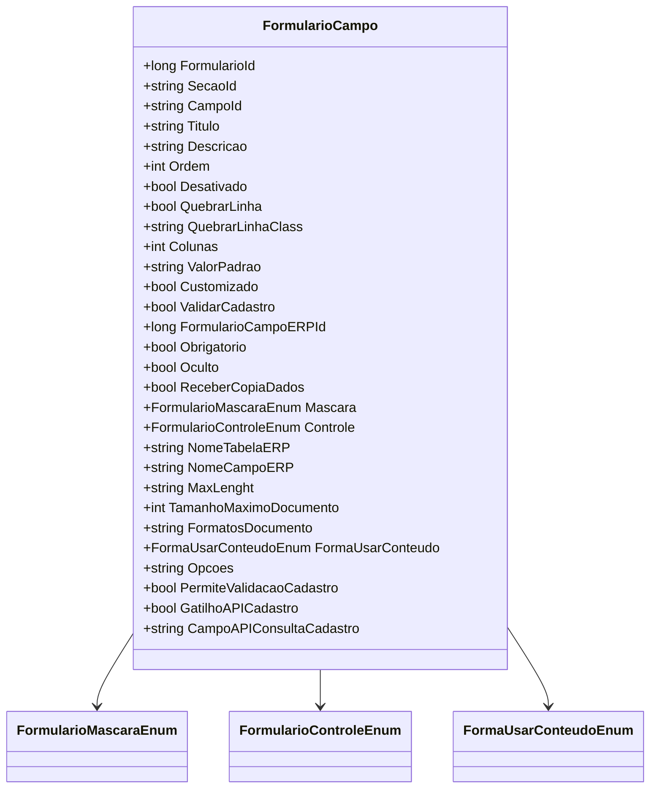

# FormularioCampo
**Namespace**: IsthmusWinthor.Dominio.POCO.Formulario  
**Nome do Arquivo**: FormularioCampo.cs

## Visão Geral e Responsabilidade
A classe `FormularioCampo` representa os campos de um formulário dentro de uma aplicação. Ela é responsável por definir as propriedades dos campos, como título, descrição, controles de formatação e regras de validação, para garantir que os dados coletados sejam consistentes e atendam aos requisitos do sistema. O problema de negócio que a classe resolve é a necessidade de uma estrutura flexível e reutilizável para criar campos em formulários, otimizando a coleta e validação de informações do usuário.

## Métodos de Negócio

### 1. Método: `getMascaraInteiro`
**Visibilidade**: private  
**Objetivo**: Gera uma máscara para campos inteiros, especificando a quantidade máxima de dígitos permitidos.  
**Comportamento**: O método constrói uma string que representa a máscara para inteiros, utilizando uma combinação de dígitos zero ('0'). O loop vai até o valor passado, `tamanhoMaximoAceito`, adicionando " || " entre os formatos resultantes.  
**Retorno**: Retorna uma string que descreve as diferentes máscaras disponíveis.

```mermaid
flowchart TD
    A[Início] --> B{tamanhoMaximoAceito > 0?}
    B -- Sim --> C[Inicia mascara como uma string vazia]
    C --> D[Itera de 1 a tamanhoMaximoAceito]
    D --> E[Adiciona '0' à máscara]
    E --> F{É o último dígito?}
    F -- Sim --> G[Retorna a máscara]
    F -- Não --> H[Adiciona " || "]
    H --> D
    B -- Não --> G
```

## Propriedades Calculadas e de Validação

- **ClassColunas**: A propriedade `ClassColunas` determina a classe CSS que deve ser aplicada ao campo com base no valor de `Colunas`. Caso o valor de `Colunas` seja inferior a 1, ele é ajustado para 1, garantindo que o campo sempre ocupe ao menos uma coluna.
  
- **MascaraDefinida**: Retorna a máscara de formatação com base no tipo de máscara selecionado na propriedade `Mascara`. Cada tipo de máscara tem um formato associado que pode incluir CEP, CPF, CNPJ, entre outros.

- **SeparadorDecimal**: Esta propriedade retorna o caractere de separação decimal apropriado, apenas se a máscara for do tipo 'Reais'.

- **Regex**: Esta propriedade define uma expressão regular para validação de e-mails caso a máscara selecionada seja do tipo 'Email'.

- **DeveConsultarApiCadastro**: Esta propriedade retorna `true` se `GatilhoAPICadastro` estiver ativado e `CampoAPIConsultaCadastro` não estiver vazio, indicando que uma consulta à API é necessária para validação.

## Navigations Property
Não existem propriedades que representam classes complexas do domínio nesta classe.

## Tipos Auxiliares e Dependências

- **Enums Utilizados**:
  - [FormularioMascaraEnum](FormularioMascaraEnum.md)
  - [FormularioControleEnum](FormularioControleEnum.md)
  - [FormaUsarConteudoEnum](FormaUsarConteudoEnum.md)

## Diagrama de Relacionamentos


A documentação acima apresenta informações detalhadas sobre a classe `FormularioCampo`, abordando suas responsabilidades, regras de negócio, métodos com lógica, propriedades calculadas e as enumerações que ela utiliza, em conformidade com as diretrizes estabelecidas.
---
Gerada em 29/12/2025 21:42:51
