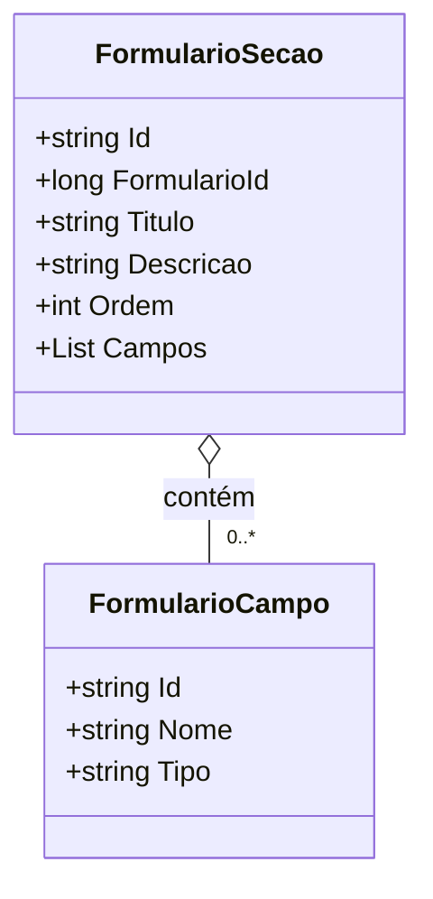

# FormularioSecao
**Namespace**: IsthmusWinthor.Dominio.POCO.Formulario  
**Nome do Arquivo**: FormularioSecao.cs

## Visão Geral e Responsabilidade
A classe `FormularioSecao` representa uma seção dentro de um formulário. Essa seção possui um título, uma descrição, uma ordem de apresentação e uma lista de campos que compõem essa seção. O principal problema de negócio que essa classe resolve é a organização e a estruturação de dados em formulários complexos, permitindo que formulários sejam compostos de várias seções de maneira hierárquica.

## Métodos de Negócio
Esta classe não contém métodos com lógica de negócio complexa.

## Propriedades Calculadas e de Validação
- Não há propriedades com lógica no `get` ou validação no `set`.

## Navigation Properties
- [FormularioCampo](FormularioCampo.md): Esta propriedade lista os campos que pertencem a esta seção do formulário.

## Tipos Auxiliares e Dependências
- Nenhum enumerador (enum) ou classe estática/helper é utilizado por esta classe.

## Diagrama de Relacionamentos

---
Gerada em 29/12/2025 21:42:58
