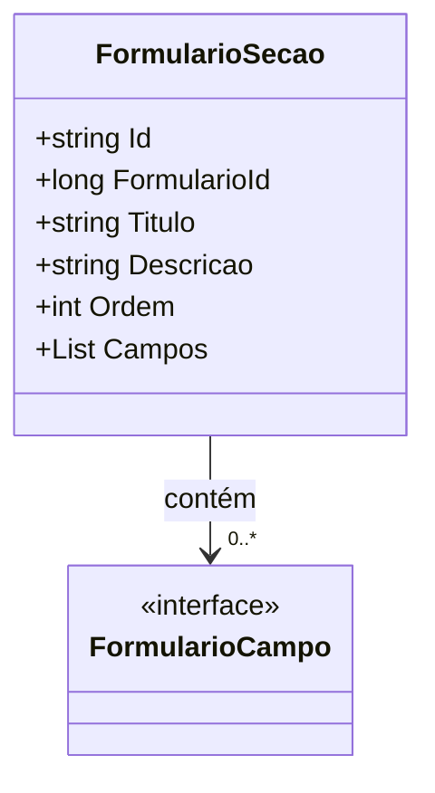

# FormularioSecao

**Namespace**: IsthmusWinthor.Dominio.POCO.Formulario  
**Nome do Arquivo**: FormularioSecao.cs  

## Visão Geral e Responsabilidade
A classe `FormularioSecao` atua como um componente do domínio responsável por agrupar campos de um formulário em seções lógicas. Ela resolve a necessidade de organizar informações em uma estrutura hierárquica, facilitando a coleta e a manipulação de dados em um contexto de formulários complexos. Cada `FormularioSecao` pode conter múltiplos campos, representando uma parte específica do formulário global.

## Métodos de Negócio
Este modelo não contém métodos complexos que implementem regras de negócio. As funções da classe se resumem a agregação de dados e não incluem lógica condicional.

## Propriedades Calculadas e de Validação
Não existem propriedades com lógica de cálculo ou validação especial na classe `FormularioSecao`. As propriedades simplesmente armazenam os dados sem regras adicionais.

## Navigations Property
- `Campos`: Esta propriedade associa a `FormularioSecao` a uma lista de campos, que estão representados na classe `FormularioCampo`.  
  - [FormularioCampo](FormularioCampo.md)

## Tipos Auxiliares e Dependências
Não são utilizados enumeradores ou classes auxiliares estáticas nesta classe.

## Diagrama de Relacionamentos

