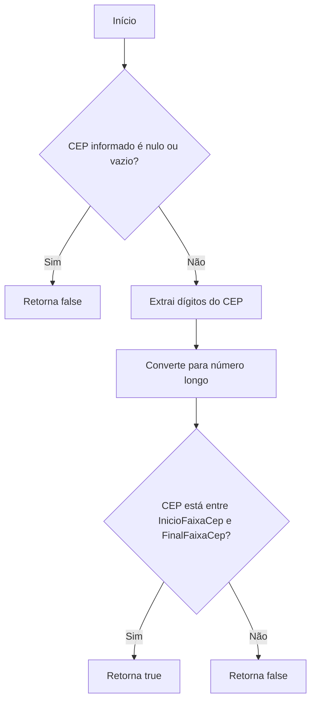
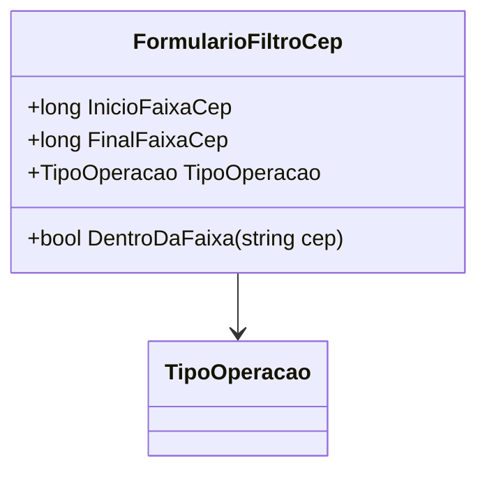

# FormularioFiltroCep

**Namespace**: IsthmusWinthor.Dominio.POCO  
**Nome do Arquivo**: FormularioFiltroCep.cs  

## Visão Geral e Responsabilidade
A classe `FormularioFiltroCep` representa um filtro utilizado para validar se um determinado CEP (Código de Endereçamento Postal) se encontra dentro de uma faixa específica definida por `InicioFaixaCep` e `FinalFaixaCep`. Esta classe é essencial para a lógica de negócios que envolve operações relacionadas a regiões geográficas baseadas em CEPs, assegurando que apenas CEPs válidos e pertencentes à faixa especificada sejam considerados.

## Métodos de Negócio

### Título: DentroDaFaixa (public)
- **Objetivo**: Garante que um CEP fornecido está dentro da faixa de CEPs estabelecida (entre `InicioFaixaCep` e `FinalFaixaCep`).
- **Comportamento**: 
  1. Verifica se o CEP informado é nulo ou vazio; se for, retorna `false`.
  2. Utiliza uma expressão regular para extrair os dígitos do CEP.
  3. Converte os dígitos extraídos em um número longo para validação.
  4. Compara o número do CEP validado com os limites da faixa (início e fim). 
  5. Retorna `true` se o CEP estiver na faixa, `false` caso contrário.
- **Retorno**: Um valor booleano que indica se o CEP pertence à faixa definida.

## Propriedades Calculadas e de Validação
- A classe não possui propriedades que realizem cálculos complexos diretamente em seu getter, mas realiza uma validação no método `DentroDaFaixa`.

## Navigations Property
- Nenhuma propriedade de navegação para classes complexas do domínio.

## Tipos Auxiliares e Dependências
- `[TipoOperacao](TipoOperacao.md)`: Enumerador utilizado para representar o tipo de operação a ser realizada com os CEPs.

## Diagrama de Relacionamentos

Esta documentação resume o funcionamento e importância da classe `FormularioFiltroCep`, estabelecendo um guia claro sobre suas responsabilidades e métodos relevantes dentro do contexto do domínio.
