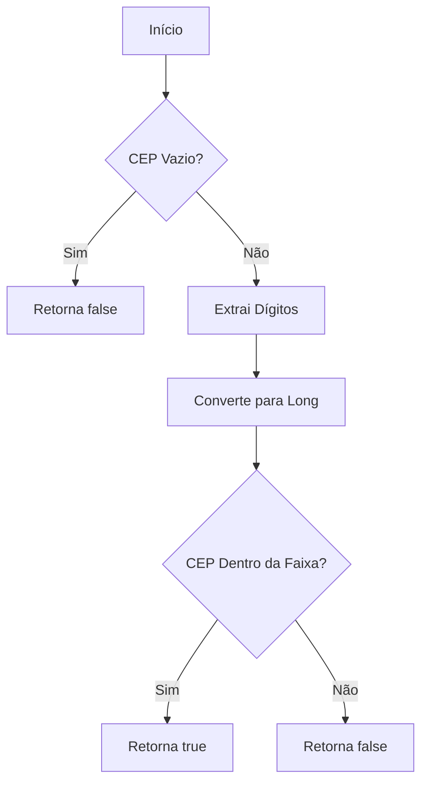
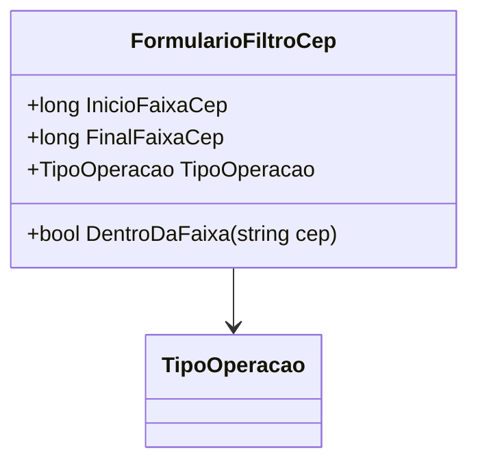

# FormularioFiltroCep
**Namespace**: IsthmusWinthor.Dominio.POCO  
**Nome do Arquivo**: FormularioFiltroCep.cs  

## Visão Geral e Responsabilidade
A classe `FormularioFiltroCep` atua como um modelo de domínio que representa um filtro para verificar se um determinado CEP (Código de Endereçamento Postal) está dentro de uma faixa específica. O objetivo dessa classe é garantir que as operações envolvendo faixas de CEP sejam realizadas de forma apropriada, assegurando que um CEP fornecido esteja entre os limites definidos pelos atributos `InicioFaixaCep` e `FinalFaixaCep`.

## Métodos de Negócio

### Título: DentroDaFaixa (public)
- **Objetivo**: Verificar se um CEP fornecido está dentro da faixa de CEPs definida por `InicioFaixaCep` e `FinalFaixaCep`.
- **Comportamento**:
  1. Valida se o CEP passado como argumento não é nulo ou vazio.
  2. Utiliza uma expressão regular para extrair apenas os dígitos do CEP.
  3. Converte o CEP filtrado em um número longo (`long`).
  4. Compara o CEP convertido com os limites da faixa (`InicioFaixaCep` e `FinalFaixaCep`).
  5. Retorna `true` se o CEP estiver dentro da faixa; caso contrário, retorna `false`.
- **Retorno**: Retorna um booleano que indica se o CEP está dentro da faixa especificada.

## Propriedades Calculadas e de Validação
Nenhuma propriedade nesta classe contém lógica complexa em seus `getters` ou validações em seus `setters`.

## Navigation Properties
Nenhuma propriedade nesta classe é uma classe complexa do domínio.

## Tipos Auxiliares e Dependências
- **Enumeradores**: 
  - [TipoOperacao](TipoOperacao.md)

## Diagrama de Relacionamentos

---
Gerada em 29/12/2025 21:34:31
